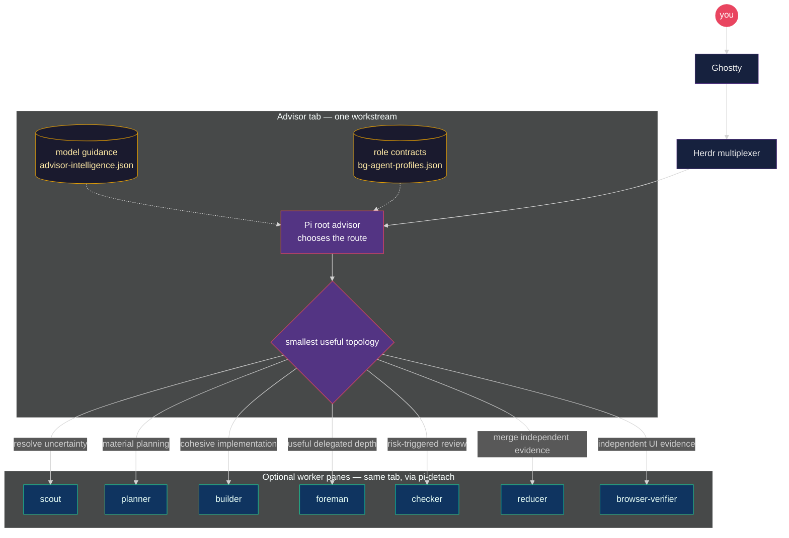
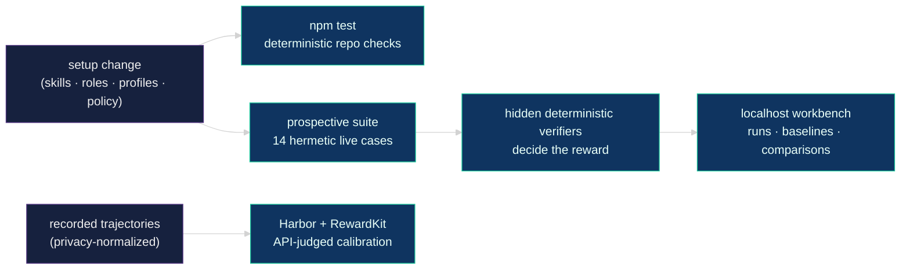

# Pi Meta Harness

An adaptive multi-agent coding advisor for Pi on macOS — one empowered maker by
default, more workers only when they earn their seat. One command installs the
whole setup from compatible npm ranges and verified Git commits, and a local
eval workbench grades every change you make to it.



**[Quick start](#-quick-start)** ·
**[How it works](#-how-it-works)** ·
**[Intelligence profiles](#-pick-an-intelligence-guide)** ·
**[Evals](#-evaluate-setup-changes)** ·
**[Docs](#-docs)**

> [!IMPORTANT]
> This is a source-installed personal harness, not a generic framework or a
> published npm package. `npm run bootstrap` changes the live Pi and Herdr
> configuration on the current machine after creating scoped backups. The
> repository contains configuration and policy only — credentials, sessions,
> memories, machine trust, and advisor runtime state stay on the machine.

## ✨ Highlights

| | |
| --- | --- |
| 🎯 **No ceremony** | Cohesive work stays with **one empowered maker**. Scouts, planners, foremen, checkers, reducers, and browser verifiers join only when they reduce uncertainty, expose real parallelism, or add independent evidence. |
| 🎚️ **Risk tiers** | Every packet is Low, Standard, or High from what it touches. The tier fixes the review route and the checker's FAIL bar, so a Medium finding on Standard work is a note or an inline repair, not another maker round. |
| 🔍 **Makers understand, checkers confirm** | Builders trace a capability end to end, deliver only inside the packet, propose sharper criteria, report adjacent defects, and run one cheap fresh-context review of their own diff before handoff. |
| 🧩 **Roles ≠ models** | Fixed semantic role contracts (`bg-agent-profiles.json`) stay stable while **switchable intelligence guides** decide which model capacity each role should prefer today. |
| 🔀 **Two worker harnesses** | Workers run through Pi, or natively through Codex CLI and Claude Code — same roles, same skills, chosen once per advisor session. The root advisor is always Pi. |
| 🧪 **Evals that bite** | 14 hermetic live cases graded by **hidden deterministic verifiers**, plus recorded-trajectory judge calibration on Harbor. A localhost workbench compares runs and baselines. |
| 📌 **Controlled updates** | Compatible npm ranges, full 40-hex Git commits, tree and SHA-256 verification, scoped backups, and a live doctor. |
| 🔒 **Public-safe by design** | Every tracked file is treated as public. A closed-allowlist privacy boundary keeps transcripts, identities, and credentials out of eval artifacts. |

## 🚀 Quick start

Targets macOS with Ghostty, Git, and Node.js ≥ 22.19. Install the host tools:

```bash
brew install herdr
brew install gentleman-programming/tap/engram
npm install -g '@earendil-works/pi-coding-agent@^0.84.4'
# Install Claude Code through its supported installer, then authenticate locally.
# For native OpenAI workers, also install Codex CLI and run `codex login`.
```

Review [`scripts/bootstrap.sh`](scripts/bootstrap.sh), then clone and bootstrap:

```bash
git clone https://github.com/nourhelmi/pi-meta-harness.git
cd pi-meta-harness
npm run bootstrap
```

Afterwards: export optional MCP credentials from your shell or secret manager,
start Pi inside Herdr, `/login` each Pi provider, confirm Claude Code auth, and
invoke `/advisor`.

<details>
<summary><b>What bootstrap does</b> (8 steps, stops if an advisor is active)</summary>

1. installs and tests the harness;
2. shows the live install plan;
3. installs the compatible browser-verifier CLI and its browser;
4. backs up and installs managed Pi configuration;
5. updates compatible npm packages and installs reviewed Git commits, including
   the public `pi-detach` repository;
6. restores the selected third-party skills;
7. installs Herdr configuration and regenerates its Pi integration;
8. runs the live doctor.

It never copies credentials and never reloads Pi.

</details>

## 🧭 How it works

You work in Ghostty; Herdr owns the tabs. `/advisor` claims one isolated
workstream and picks the **smallest useful topology** for the task — the
diagram above is the whole story. `pi-detach` keeps every worker visible in a
named pane inside the advisor's tab. The root advisor may implement Low and
Standard packets itself; High packets always go to a visible worker.

Start an advisor in a fresh Pi tab inside Herdr:

```text
/advisor

my task here
```

`/advisor` is a skill invoke, not a CLI — there is no `--profile` flag. It asks
once for the worker harness and persists the answer for that session; skip the
question with an explicit entrypoint:

| Entrypoint | Workers run through |
| --- | --- |
| `/skill:advisor-pi` | Pi, for every semantic role |
| `/skill:advisor-native` | Codex CLI (`openai-codex`/`openai`) and Claude Code (`claude-bridge`/`anthropic`) |

In native mode the same role names and role skills stay in force. Cursor/Grok
identities have no native route, so the advisor picks a task-fit
OpenAI/Anthropic alternative from the active guide or reports the mismatch.
Native workers write to a reserved result path; a missing or malformed result
keeps the pane visible instead of being reported as success.

Deep dives: [`docs/advisor-runtime.md`](docs/advisor-runtime.md) ·
[`docs/architecture.md`](docs/architecture.md)

## 🧠 Pick an intelligence guide

Named profiles answer one question: **which model capacity should each role
prefer today?** They never rewrite role contracts, poll quota, or act as
allowlists. The guide is machine-global; pick it before workers launch:

```bash
node "$HOME/.pi/agent/bin/intelligence-profile.mjs" --list
node "$HOME/.pi/agent/bin/intelligence-profile.mjs" grok-cycle
```

| Profile | Use it when |
| --- | --- |
| `codex-max` *(default)* | Codex weekly capacity is healthy. |
| `codex-lean` | Codex capacity is low but still available for the hardest work. |
| `anthropic-heavy` | You intentionally want Anthropic to carry implementation and review. |
| `balanced` | Codex handles hard builds while Anthropic carries ordinary builds and checks. |
| `grok-cycle` | Codex is unavailable and Grok should own the substantial maker/review cycle. |

Mid-session: say `switch to lean` in chat, or run the same node command.
Already-running workers keep their launch model. Recommendations are advisory —
the advisor may choose outside the guide with a concise rationale when
material. Quota is **not** polled; you choose.

Model orders, reasoning guidance, and the quota pick tree:
[`docs/intelligence-profiles.md`](docs/intelligence-profiles.md)

## 🧪 Evaluate setup changes

Two complementary tracks keep the advisor honest:



```bash
npm ci && npm test                                   # deterministic checks

npm run eval:advisor:prospective -- single-maker-fast-path --name my-change
npm run eval:advisor:prospective:view                # http://127.0.0.1:4318
```

Prospective execution is stochastic, but hidden workspace and orchestration
checks grade it deterministically — the model's own completion signal is never
authoritative. Worker count and duration are diagnostics, never rewards, so
gratuitous fan-out cannot earn a pass. The separate Harbor track scores
recorded trajectories with an API-backed judge.

Full guide (suites, trials, baselines, comparisons, privacy boundary):
[`docs/advisor-evals.md`](docs/advisor-evals.md)

## 📚 Docs

| Doc | What's inside |
| --- | --- |
| [`advisor-runtime.md`](docs/advisor-runtime.md) | Workstream isolation, adaptive topology, roles, pane rules |
| [`advisor-protocol.md`](docs/advisor-protocol.md) | Host-neutral layers, canonical event trace, validator, migration status |
| [`intelligence-profiles.md`](docs/intelligence-profiles.md) | Guides, quota pick tree, per-role recommendations |
| [`advisor-evals.md`](docs/advisor-evals.md) | Live prospective suite + Harbor calibration |
| [`architecture.md`](docs/architecture.md) | Installer topology and ownership boundaries |
| [`security.md`](docs/security.md) | Public-repo portability boundary |
| [`cutover.md`](docs/cutover.md) | Updating an existing machine |
| [`macos-tcc.md`](docs/macos-tcc.md) | Keeping macOS permission dialogs from blocking agents |

<details>
<summary><b>🗺️ Repository map</b></summary>

- `extensions/` — first-party advisor/runtime extensions, the thin
  `unified-edit.ts` coordinator, and the reviewed
  `unified-edit-fallback/upstream.ts` snapshot (primary read/edit/undo is the
  compatible-range `pi-better-edit` package).
- `skills/` — advisor doctrine, semantic worker roles, triage, and graph-driver
  skills.
- `config/bg-agent-profiles.json` — fixed role contracts, portable skill paths,
  and instructional caps.
- `config/intelligence-profiles/` — switchable model and reasoning guidance.
- `config/advisor-core/` — canonical event trace JSON Schema and fixture
  traces every host emits and every surface renders.
- `config/settings.overlay.json` — safe Pi defaults, compatible npm ranges, and
  exact Git commits;
  reinstall preserves the user's existing runtime model preference.
- `config/mcp.json` — MCP definitions containing environment placeholders only.
- `config/skill-sources.json` and `config/third-party-skills.lock.json` —
  reviewed third-party skills at exact commits, trees, and content hashes.
- `config/skill-removals.json` — superseded upstream skill names removed during
  a reviewed rename or consolidation cutover.
- `evals/harbor/` — fixed recorded-trajectory calibration tasks.
- `evals/prospective/` — hermetic live advisor cases and hidden verifiers.
- `evals/baselines/prospective/` — tracked privacy-safe comparison baselines.
- `scripts/advisor-prospective*.mjs` — live run, verification, suite, baseline,
  and comparison tooling.
- `scripts/advisor-eval-dashboard/` — localhost prospective-run workbench.
- `scripts/advisor-eval.mjs` and `scripts/advisor-harbor-lib.mjs` —
  privacy-bounded trace normalization and Harbor task materialization.
- `scripts/intelligence-profile.mjs` — guide validator and mid-session switcher.
- `scripts/meta-harness.mjs` and `scripts/bootstrap.sh` — install, doctor,
  restore, validation, and fresh-machine bootstrap.
- `herdr/` — portable Herdr theme, UI, keybindings, and notification sounds.
- `docs/` — runtime, architecture, security, cutover, intelligence, and eval
  references.

`pi-detach` stays in its own public repository and is installed from a full Git
commit. This harness is the single bootstrap entry that composes it with the
rest of the setup.

</details>

## 🛡️ Safety and reproducibility

Pi packages use compatible npm ranges or full reviewed Git commits. Third-party
skills are fetched at full Git commits, verified against recorded tree IDs,
copied instead of symlinked, and checked against per-skill SHA-256 hashes. Real
Pi targets always require `--live`, and every install creates a restorable
backup first.

Use a sandbox when you change the harness:

```bash
npm ci && npm test
node scripts/meta-harness.mjs install --target /tmp/pi-meta-harness-test
node scripts/meta-harness.mjs doctor --target /tmp/pi-meta-harness-test
```

Before publication or a live cutover, opt in to bounded remote fetch
verification (20-second timeout per pin; never part of offline unit tests):

```bash
node scripts/meta-harness.mjs verify-git-pins
```

<details>
<summary><b>Backups and restore</b></summary>

Each install creates a restorable backup under:

```text
~/.pi/agent/backups/pi-meta-harness/<timestamp>/
~/.config/herdr/backups/pi-meta-harness-herdr/<timestamp>/
```

Restore with:

```bash
node scripts/meta-harness.mjs restore --live --backup <pi-backup-path>
node scripts/meta-harness.mjs restore-herdr --live --backup <herdr-backup-path>
```

The marketing and fal.ai skill groups track their reviewed latest layouts.
Cutover removes superseded skill names after backing them up, so renamed and
consolidated skills do not remain as duplicate legacy copies.

</details>

## 🔐 Credentials

Copy only variable names from [`.env.example`](.env.example). Never commit
values. Rotate a credential immediately if it enters a transcript, diff, shell
history, or repository. See [`docs/security.md`](docs/security.md) for the
complete portability boundary.

## 📄 License

MIT. Third-party components keep their own licenses and notices; see
[`NOTICE.md`](NOTICE.md) and
[`config/third-party-extensions.lock.json`](config/third-party-extensions.lock.json).
