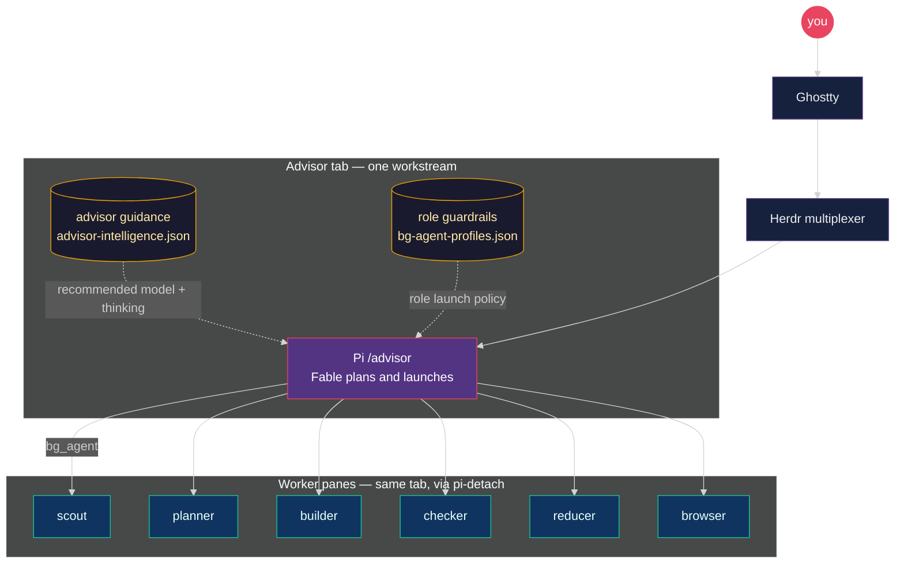
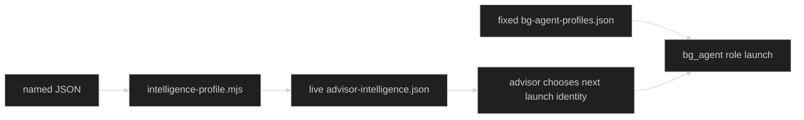
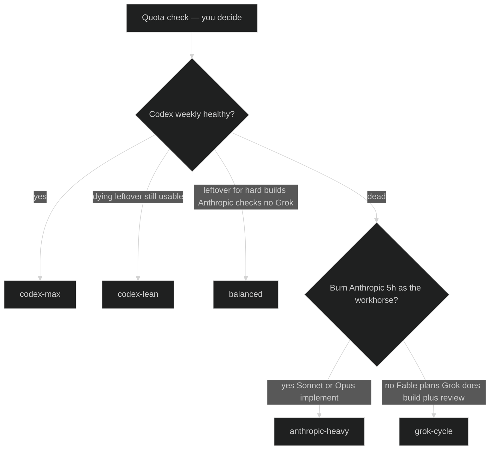

# Pi Meta Harness

One Ghostty window. One Herdr multiplexer. A Fable advisor that fans work into
named worker panes. Switchable advisor guidance. Fixed role guardrails. Exact pins. No secrets in Git.

The repository is configuration and policy only. Credentials, sessions, memories,
machine trust, caches, and advisor runtime stay on the machine.

## At a glance

You sit in Ghostty. Herdr owns tabs. `/advisor` claims one isolated workstream.
That Pi session stays Fable. It launches workers through `pi-detach` `bg_agent`
into panes in the **same tab**. Fixed role configuration enforces skills, tools,
anchors, and cycle caps. A separate live intelligence guide recommends `model`
+ `thinking` choices to the advisor. Quota is not polled — you pick the guide.



Deep dive: [`docs/intelligence-profiles.md`](docs/intelligence-profiles.md) ·
runtime rules: [`docs/advisor-runtime.md`](docs/advisor-runtime.md)

## Docs

- [`docs/intelligence-profiles.md`](docs/intelligence-profiles.md) — advisory guides, quota pick tree, `/advisor` vs switcher, per-role recommendations
- [`docs/advisor-runtime.md`](docs/advisor-runtime.md) — workstream isolation, `advisor_launch`, pane labels
- [`docs/architecture.md`](docs/architecture.md) — installer topology
- [`docs/security.md`](docs/security.md) — portability boundary
- [`docs/cutover.md`](docs/cutover.md) — updating an existing machine
- [`docs/macos-tcc.md`](docs/macos-tcc.md) — grant Ghostty Full Disk Access so machine-wide searches do not modal-block
- [`docs/advisor-evals.md`](docs/advisor-evals.md) — sanitized trace diagnostics and rubric/checkpoint fixtures


## Fresh-machine setup

Install Node.js 22.19 or newer and the host tools first:

```bash
brew install herdr
brew install gentleman-programming/tap/engram
npm install -g @earendil-works/pi-coding-agent@0.84.1
# Install Claude Code through its supported installer, then log in locally.
```

Clone the harness and run one command:

```bash
git clone https://github.com/nourhelmi/pi-meta-harness.git
cd pi-meta-harness
npm run bootstrap
```

The bootstrap command:

1. installs and tests the harness;
2. shows the live install plan;
3. installs the exact browser-verifier CLI and its browser;
4. backs up and installs managed Pi configuration;
5. installs exact Pi package pins, including the public `pi-detach` repository;
6. restores the selected third-party skills;
7. installs Herdr configuration and regenerates its Pi integration;
8. runs the live doctor.

The installer stops if an advisor or worker is active. It never copies credentials or reloads Pi.

After bootstrap, export optional MCP credentials through your shell or secret manager, start Pi inside Herdr, use `/login` for each provider, and run `/advisor`.

## Start an advisor and pick a guide

`/advisor` is a skill invoke, not a CLI with flags. There is no
`/advisor "task" --profile lean`. The intelligence guide is **machine-global**.

In a fresh Pi tab inside Herdr (cwd already the repo):

```text
/advisor

my task here
```

Pick the guide **before** workers launch:

```bash
node "$HOME/.pi/agent/bin/intelligence-profile.mjs" --list
node "$HOME/.pi/agent/bin/intelligence-profile.mjs" grok-cycle
```

Names: `codex-max` | `codex-lean` | `anthropic-heavy` | `balanced` | `grok-cycle`. Mid-session:
say `switch to lean` in chat, or run the same node command. Already-running
workers keep their launch model. The advisor pane does not auto `/model`.
The advisor may choose outside the guide with a concise rationale; workers do
not reject identities that are absent from the recommendations.

Quota is **not** polled. You choose. Deep dive (topology, spend, pick tree,
per-role recommendations): [`docs/intelligence-profiles.md`](docs/intelligence-profiles.md).

## Intelligence guidance

Second figure: which wallet pays. Shipped default **`codex-max`**. Reinstall
keeps `intelligence-profiles/ACTIVE`. The shipped guides recommend Cursor only
as `cursor/grok-4.6`. Character and reasoning notes are advisory, not exhaustive.





| Profile | When | Implementation | Adversarial review | Procedural |
| --- | --- | --- | --- | --- |
| `codex-max` | Codex weekly healthy | Sol | Terra | Luna |
| `codex-lean` | Codex leftover; Grok is `grok-cycle` | Sol hard, Sonnet medium, Luna small | Terra | Luna, Sonnet |
| `anthropic-heavy` | Spend Anthropic on purpose | Sonnet | Sonnet / Opus | Luna, else Grok |
| `balanced` | No Grok; Codex builds hard, Anthropic checks | Sonnet default, Sol/Terra hard, Opus greenfield UX | Sonnet / Opus | Luna, Sonnet |
| `grok-cycle` | No Codex; Grok owns maker + review | Grok | Grok | Sonnet |

## Repository map

- `extensions/` — first-party advisor extensions and the reviewed `unified-edit.ts` snapshot.
- `skills/` — first-party advisor, worker-role, triage, and graph-driver skills.
- `config/intelligence-profiles/` — named advisor intelligence guides (`codex-max`, `codex-lean`, `anthropic-heavy`, `balanced`, `grok-cycle`).
- `config/bg-agent-profiles.json` — fixed generic role launch guardrails; switching never changes it.
- `~/.pi/agent/advisor-intelligence.json` — installed live copy of the selected advisory guide.
- `scripts/intelligence-profile.mjs` — mid-session switcher.
- `scripts/advisor-eval.mjs` — privacy-bounded advisor trace ingestion, diagnostics, and rubric packets.
- `docs/intelligence-profiles.md` — topology, quota pick tree, per-role recommendations.
- `config/settings.overlay.json` — safe Pi defaults and exact package pins. Reinstall preserves the existing `defaultProvider`, `defaultModel`, and `defaultThinkingLevel` because `/model` owns that runtime preference.
- `config/mcp.json` — MCP definitions with environment placeholders only.
- `config/skill-sources.json` — selected third-party skills at exact source commits and trees.
- `herdr/` — portable Herdr theme, UI, keybindings, and notification sounds.
- `scripts/meta-harness.mjs` — plan, install, doctor, restore, and skill commands.
- `scripts/bootstrap.sh` — the one-command fresh-machine install.

`pi-detach` stays in its own public repository and is installed from a full Git commit. This harness is the single bootstrap entry that composes it with the rest of the setup.

## Safety and reproducibility

Use a sandbox when you change the harness:

```bash
npm ci
npm test
node scripts/meta-harness.mjs install --target /tmp/pi-meta-harness-test
node scripts/meta-harness.mjs doctor --target /tmp/pi-meta-harness-test
```

Normal tests validate that every Git package uses a syntactically exact 40-hex
commit without requiring network access. Before publication or a live cutover,
opt in to bounded remote fetch verification:

```bash
node scripts/meta-harness.mjs verify-git-pins
```

Each exact commit fetch has a 20-second timeout; this network check is not part
of offline unit tests.

Exact versions or full commits pin Pi packages. First-party harness files are copied from this repository. Third-party skills are fetched at full Git commits, verified against recorded tree IDs, copied instead of symlinked, and checked against per-skill SHA-256 hashes. The skills installer CLI is also pinned.

The marketing and fal.ai groups intentionally use the last reviewed revisions that still contain the selected skill names; their newer upstream layouts renamed or removed those skills.

Real Pi targets always require `--live`. Each install creates a restorable backup under:

```text
~/.pi/agent/backups/pi-meta-harness/<timestamp>/
```

Herdr backups are under:

```text
~/.config/herdr/backups/pi-meta-harness-herdr/<timestamp>/
```

Restore with:

```bash
node scripts/meta-harness.mjs restore --live --backup <pi-backup-path>
node scripts/meta-harness.mjs restore-herdr --live --backup <herdr-backup-path>
```

## Credentials

Copy only variable names from [`.env.example`](.env.example). Never commit values. Rotate a credential immediately if it enters a transcript, diff, shell history, or repository.

See [`docs/security.md`](docs/security.md) for the complete portability boundary and [`docs/cutover.md`](docs/cutover.md) for controlled updates to an existing machine.

## License

MIT. Third-party components keep their own licenses and notices; see [`NOTICE.md`](NOTICE.md) and [`config/third-party-extensions.lock.json`](config/third-party-extensions.lock.json).
