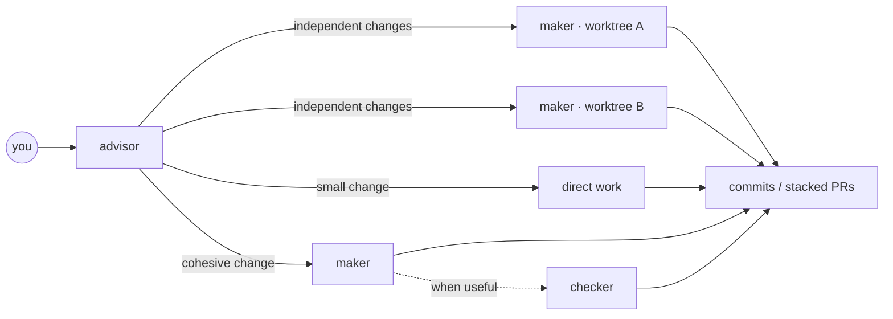

# Pi Meta Harness

A Git-native coding team for Pi: one advisor, empowered makers, optional independent
review, and no orchestration theatre.

The advisor picks the smallest topology that can finish the job. It works directly when
that is cheapest, delegates a cohesive change to one maker, or fans out genuinely
independent work into separate Git worktrees. Workers own implementation, verification,
and commits. The advisor coordinates instead of duplicating their work.



## What changed

The advisor stack was cut from **98,933 bytes / 1,593 lines** to **26,395 bytes /
450 lines**. The core doctrine fell from **29,790 bytes / 476 lines** to **7,429 bytes /
130 lines**. That is a measured 73–75% reduction in instruction surface, not a synthetic
performance claim.

The current setup deliberately has:

- **Three roles:** advisor, builder, checker. All can investigate, edit, and verify within
  their owned surface.
- **No scout/planner/reducer pipeline.** The owner greps what it needs and starts.
- **No severity choreography.** Verification depth follows consequence; review is the
  advisor's judgment or the repository's requirement.
- **No acceptance-report bureaucracy.** A packet carries a short goal, scope, and one
  done-when line (or a few concrete lines when the task genuinely needs them).
- **No shadow implementation.** While a maker runs, the advisor waits, answers questions,
  or prepares independent work.
- **Git as the ledger.** Makers commit as they go. Branches, worktrees, diffs, and PRs are
  the review trail.
- **Project-owned delivery gates.** Repository tests, CI, and required PR review remain
  authoritative; the harness does not invent extra ceremony.

## The operating model

### 1. Pick the cheapest route

- Work directly for a small or tightly coupled change.
- Use one maker for one cohesive outcome.
- Use parallel makers only when the work is actually independent.
- Use a child advisor only when a whole sub-outcome needs its own coordination.
- Add a checker when independent review is worth the cost. This is judgment, not a fixed
  stage.

### 2. Give ownership, not a script

A useful packet says:

```text
Goal: migrate the worker runtime to the new provider.
Decided: preserve public behavior and current auth semantics.
Write surface: packages/runtime/**
Done when: the migrated runtime passes its affected integration checks and is committed.
```

The maker chooses commands and implementation details. A check it did not run is not a
pass, but it does not need to translate normal engineering into a claims spreadsheet.

### 3. Parallelize with real Git worktrees

```bash
node ~/.pi/agent/bin/advisor-worktree.mjs add ../growth-os-runtime -b migrate/runtime
```

The helper runs `git worktree add` and copies untracked or ignored `.env*` files to the
same relative paths in the new worktree. Existing destination files are never overwritten.
Use `--no-env` to opt out.

The runtime reads `git worktree list` at admission time, so worktrees created after an
advisor starts are accepted without restarting the advisor.

### 4. Deliver commits

One writer owns a checkout at a time. Makers commit on their branch as they go. Parallel
branches can become stacked or independent PRs with useful history instead of a giant
unattributed working-tree diff.

## Quick start

Targets macOS with Git, Ghostty, Herdr, and Node.js 22.19+.

```bash
brew install herdr
brew install gentleman-programming/tap/engram
npm install -g '@earendil-works/pi-coding-agent@^0.84.4'
# Install Claude Code through its supported installer.
# Install Codex CLI too if you want native OpenAI workers.

git clone https://github.com/nourhelmi/pi-meta-harness.git
cd pi-meta-harness
npm run bootstrap
```

`bootstrap` tests the repository, installs the browser verifier, backs up and installs the
Pi harness, updates reviewed packages, restores pinned skills, installs the native
Claude Code/Codex advisor skills and Herdr integration, and runs the live Pi doctor.
It never copies credentials or reloads an active agent process.

Start Pi inside Herdr, then invoke:

```text
/advisor

migrate this app to Cloudflare Workers
```

Choose the worker harness once per advisor session:

| Entrypoint | Worker runtime |
| --- | --- |
| `/skill:advisor-pi` | Pi for every role |
| `/skill:advisor-native` | Codex CLI for OpenAI roles and Claude Code for Anthropic roles |

Existing Pi sessions retain the instructions they loaded. Start a fresh session after an
install when you need the new doctrine immediately.

### Session model routing

With `@nourhelmi/agent-router` configured, use Pi directly:

```text
/jev-router on       # automatic model/effort selection in this session
/jev-router off      # manual selection in this session
/jev-router config   # dialog: default for future sessions
/jev-router          # actual host status
```

A compact footer-area row below the input shows the host-confirmed state. Changes
apply to new launches, not existing workers; commands wait for the current turn to
finish. Resume/reload retain the session setting. New/forked sessions use defaults.
An older managed host reports **restart required**; `/reload` cannot replace its code.
See [routing controls and lifecycle](docs/pi-detach-runtime-bridge.md#optional-external-agent-router).

## Updating a local checkout

```bash
npm ci
npm test
node scripts/meta-harness.mjs plan --live
node scripts/meta-harness.mjs install --live
node scripts/meta-harness.mjs install-skills --live
node scripts/install-native-skills.mjs
node scripts/meta-harness.mjs install-herdr-config --live
node scripts/meta-harness.mjs install-herdr-integration --live
node scripts/meta-harness.mjs doctor --live
```

Live commands create scoped backups and refuse to mutate an active advisor setup unless
you explicitly pass `--allow-active`. The installer does not reload Pi or Herdr.

The native Claude Code/Codex skill bundle is separate from the Pi installation: the Pi
installer and doctor do not update or verify it. Always rerun `install-native-skills.mjs`
when updating those hosts, then start fresh native conversations. See
[native advisor skills](docs/native-advisor-skills.md).

`pi-detach` is a separate first-party package that provides visible background commands
and worker panes. It tracks GitHub origin/HEAD:

```bash
pi update --extensions
```

## Intelligence profiles

Profiles recommend model capacity; they do not change role authority or act as allowlists.
The advisor may deviate when the task warrants it.

```bash
node "$HOME/.pi/agent/bin/intelligence-profile.mjs" --list
node "$HOME/.pi/agent/bin/intelligence-profile.mjs" codex-lean
```

| Profile | Intended balance |
| --- | --- |
| `codex-max` | Strong Codex capacity across substantial work |
| `codex-lean` | Codex-only routing with GPT-6 Sol high/xhigh/max |
| `anthropic-heavy` | Opus 5.5 high advises; Opus 5.5 medium implements and checks |
| `balanced` | Opus 5.5 high advises and handles greenfield UX; GPT-6 Sol builds and checks |
| `grok-cycle` | Grok carries the substantial cycle when Codex is unavailable |

See [`intelligence-profiles.md`](docs/intelligence-profiles.md).

## Verification and evals

```bash
npm test
npm run eval:advisor:prospective -- single-maker-fast-path --name my-change
npm run eval:advisor:prospective:view
```

Deterministic repository tests cover policy, runtime, installer, worktree admission, and
extension behavior. The prospective suite exercises live routing against hidden
workspace verifiers. Recorded, privacy-normalized trajectories support separate Harbor
calibration. Worker count and duration are diagnostics, not rewards.

See [`advisor-evals.md`](docs/advisor-evals.md).

## Architecture

Pi and Herdr are the normal path. `pi-detach` keeps workers visible in the advisor tab and
wakes the root when work settles. The portable runtime and BB client are optional. The
managed `advisor-native` integration remains experimental; the ordinary Pi-root native
worker route is the supported daily workflow.

Canonical event traces and host bindings are documented in
[`advisor-protocol.md`](docs/advisor-protocol.md).

| Document | Purpose |
| --- | --- |
| [`advisor-runtime.md`](docs/advisor-runtime.md) | Workstream isolation, topology, roles, admission, settlement |
| [`outcome-owned-orchestration.md`](docs/outcome-owned-orchestration.md) | Handoffs, continuation, graphs, and repair-first review |
| [`architecture.md`](docs/architecture.md) | Installer topology and ownership boundaries |
| [`security.md`](docs/security.md) | Public-repository and credential boundary |
| [`cutover.md`](docs/cutover.md) | Updating an existing machine |
| [`macos-tcc.md`](docs/macos-tcc.md) | Avoiding macOS permission deadlocks |

## Safety

Every tracked file is treated as public. Credentials, sessions, memory, machine trust, and
advisor runtime state remain local. Third-party skills are pinned to reviewed commits,
trees, and content hashes. Every live installation creates a restorable backup under
`~/.pi/agent/backups/pi-meta-harness/` (and the equivalent Herdr backup directory).

Use `.env.example` only for variable names. Never commit secret values.

## License

MIT. Third-party components retain their licenses; see [`NOTICE.md`](NOTICE.md) and
[`config/third-party-extensions.lock.json`](config/third-party-extensions.lock.json).
