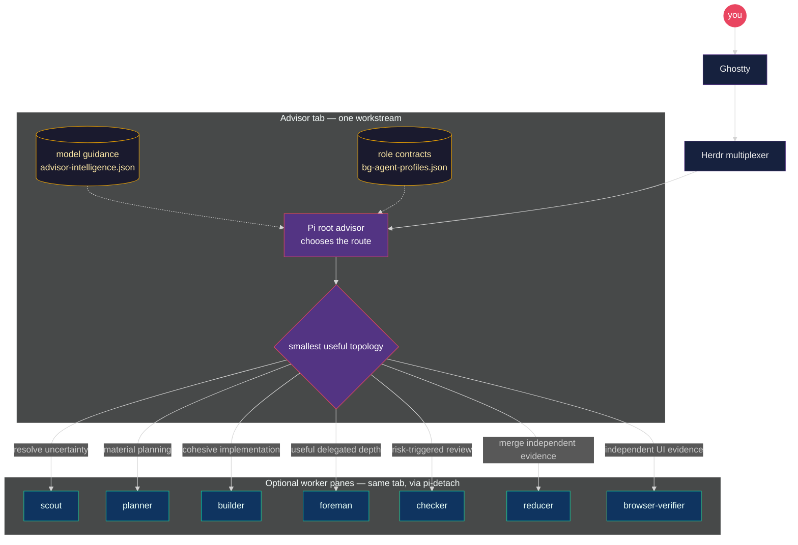

# Pi Meta Harness

An opinionated, reproducible macOS setup for running Pi coding advisors in
Ghostty and Herdr. It installs adaptive role-aware orchestration, switchable
model guidance, exact package and skill pins, and a local evaluation workbench
without putting credentials or runtime state in Git.

> [!IMPORTANT]
> This is a source-installed personal harness, not a generic framework or a
> published npm package. `npm run bootstrap` changes the live Pi and Herdr
> configuration on the current machine after creating scoped backups.

The repository contains configuration and policy only. Credentials, sessions,
memories, machine trust, caches, and advisor runtime state stay on the machine.

## At a glance

You work in Ghostty while Herdr owns the tabs. `/advisor` claims one isolated
workstream and chooses the smallest useful topology for the task. Cohesive work
normally stays with one empowered maker; scouts, planners, foremen, checkers,
reducers, browser verifiers, and validated graphs are added only when they
reduce uncertainty, expose real parallelism, or add worthwhile independent
evidence.

The root advisor always runs as a Pi process and does not implement product
changes itself. A fresh install defaults that Pi session to Fable, while an
existing install keeps its runtime model preference and may use a documented
fallback. Workers run through either Pi or provider-native Codex/Claude
harnesses, selected once per advisor session. `pi-detach` keeps every worker
visible in a named pane inside the advisor's tab.



Deep dive: [`docs/intelligence-profiles.md`](docs/intelligence-profiles.md) ·
runtime rules: [`docs/advisor-runtime.md`](docs/advisor-runtime.md)

## Docs

- [`docs/intelligence-profiles.md`](docs/intelligence-profiles.md) — advisory
  guides, quota pick tree, `/advisor` vs switcher, and per-role recommendations
- [`docs/advisor-runtime.md`](docs/advisor-runtime.md) — workstream isolation, `advisor_launch`, pane labels
- [`docs/architecture.md`](docs/architecture.md) — installer topology
- [`docs/security.md`](docs/security.md) — portability boundary
- [`docs/cutover.md`](docs/cutover.md) — updating an existing machine
- [`docs/macos-tcc.md`](docs/macos-tcc.md) — prevent macOS permission
  dialogs from blocking unattended machine-wide searches
- [`docs/advisor-evals.md`](docs/advisor-evals.md) — Harbor calibration and
  subscription-backed live setup evaluation

## Fresh-machine setup

The bootstrap targets macOS and expects Ghostty, Git, Node.js 22.19 or newer,
Herdr, Engram, Pi, and Claude Code. Install the host tools first:

```bash
brew install herdr
brew install gentleman-programming/tap/engram
npm install -g @earendil-works/pi-coding-agent@0.84.3
# Install Claude Code through its supported installer, then authenticate locally.
# For native OpenAI workers, also install Codex CLI and run `codex login`.
```

Review [`scripts/bootstrap.sh`](scripts/bootstrap.sh) before running it. Then
clone the harness and run the live bootstrap:

```bash
git clone https://github.com/nourhelmi/pi-meta-harness.git
cd pi-meta-harness
npm run bootstrap
```

The bootstrap command:

1. installs and tests the harness;
2. shows the live install plan;
3. installs the exact browser-verifier CLI and its browser;
4. backs up and installs managed Pi configuration;
5. installs exact Pi package pins, including the public `pi-detach` repository;
6. restores the selected third-party skills;
7. installs Herdr configuration and regenerates its Pi integration;
8. runs the live doctor.

The installer stops if an advisor or worker is active. It never copies credentials or reloads Pi.

After bootstrap, export optional MCP credentials through your shell or secret
manager. Start Pi inside Herdr, use `/login` for each Pi provider, confirm Claude
Code authentication, run `codex login` if you want native OpenAI workers, and
then invoke `/advisor`.

## Start an advisor, choose a worker harness, and pick a guide

`/advisor` is a skill invoke, not a CLI with flags. There is no
`/advisor "task" --profile lean`. The intelligence guide is **machine-global**.

In a fresh Pi tab inside Herdr (cwd already the repo), use `/advisor` to choose
the worker harness interactively:

```text
/advisor

my task here
```

Or choose it directly with one of the explicit entrypoints:

```text
/skill:advisor-pi
/skill:advisor-native
```

The choice is persisted and authoritative for that advisor session; conflicting
per-launch overrides are rejected. In **Pi** mode, all semantic
roles run as Pi workers. In **native** mode, the same role names and role skills
remain in force, while the selected intelligence-profile identity determines the
runtime: `openai-codex`/`openai` models use Codex CLI and
`claude-bridge`/`anthropic` models use Claude Code. The root advisor never moves
out of Pi. Native mode cannot directly launch a Cursor/Grok identity; the advisor
must choose a task-fit OpenAI or Anthropic alternative from the active guide (or
report that no appropriate native route exists). Native workers receive a
reserved result path, and a missing or malformed result keeps the pane visible
instead of being reported as successful.

Pick the guide **before** workers launch:

```bash
node "$HOME/.pi/agent/bin/intelligence-profile.mjs" --list
node "$HOME/.pi/agent/bin/intelligence-profile.mjs" grok-cycle
```

Names: `codex-max` | `codex-lean` | `anthropic-heavy` | `balanced` | `grok-cycle`. Mid-session:
say `switch to lean` in chat, or run the same node command. Already-running
workers keep their launch model. The advisor pane does not auto `/model`.
The advisor may choose outside the guide without asking permission merely
because an identity is unlisted, recording a concise rationale when material;
workers do not reject identities absent from the recommendations.

Quota is **not** polled. You choose. Deep dive (topology, spend, pick tree,
per-role recommendations): [`docs/intelligence-profiles.md`](docs/intelligence-profiles.md).

## Intelligence guidance

Named profiles answer one operational question: which available model capacity
should the advisor prefer for each role today? They never rewrite role contracts,
poll quota, or act as model allowlists. The shipped default is **`codex-max`**,
and reinstall preserves the selected `intelligence-profiles/ACTIVE` name.

| Profile | Use it when |
| --- | --- |
| `codex-max` | Codex weekly capacity is healthy. |
| `codex-lean` | Codex capacity is low but still available for the hardest work. |
| `anthropic-heavy` | You intentionally want Anthropic to carry implementation and review. |
| `balanced` | Codex handles hard builds while Anthropic carries ordinary builds and checks. |
| `grok-cycle` | Codex is unavailable and Grok should own the substantial maker/review cycle. |

The detailed model order, reasoning guidance, fallback behavior, and quota pick
tree live in [`docs/intelligence-profiles.md`](docs/intelligence-profiles.md).

## Evaluate setup changes

Run deterministic repository checks before touching the live setup:

```bash
npm ci
npm test
```

To exercise the current advisor with existing Pi and native CLI subscriptions,
run one targeted prospective case and open the local workbench:

```bash
npm run eval:advisor:prospective -- single-maker-fast-path --name my-change
npm run eval:advisor:prospective:view
```

Open <http://127.0.0.1:4318>. Prospective execution is stochastic, but hidden
workspace and orchestration checks grade it deterministically. The separate
Harbor track scores privacy-normalized recorded trajectories with an API-backed
judge. See [`docs/advisor-evals.md`](docs/advisor-evals.md) before running a full
suite or promoting a comparison baseline.

## Repository map

- `extensions/` — first-party advisor/runtime extensions and the reviewed
  `unified-edit.ts` snapshot.
- `skills/` — advisor doctrine, semantic worker roles, triage, and graph-driver
  skills.
- `config/bg-agent-profiles.json` — fixed role contracts, portable skill paths,
  and instructional caps.
- `config/intelligence-profiles/` — switchable model and reasoning guidance.
- `config/settings.overlay.json` — safe Pi defaults and exact package pins;
  reinstall preserves the user's existing runtime model preference.
- `config/mcp.json` — MCP definitions containing environment placeholders only.
- `config/skill-sources.json` — reviewed third-party skills at exact commits,
  trees, and content hashes.
- `evals/harbor/` — fixed recorded-trajectory calibration tasks.
- `evals/prospective/` — hermetic live advisor cases and hidden verifiers.
- `evals/baselines/prospective/` — tracked privacy-safe comparison baselines.
- `scripts/advisor-prospective*.mjs` — live run, verification, suite, baseline,
  and comparison tooling.
- `scripts/advisor-eval-dashboard/` — localhost prospective-run workbench.
- `scripts/advisor-eval.mjs` and `scripts/advisor-harbor-lib.mjs` —
  privacy-bounded trace normalization and Harbor task materialization.
- `scripts/intelligence-profile.mjs` — guide validator and mid-session switcher.
- `scripts/meta-harness.mjs` and `scripts/bootstrap.sh` — install, doctor,
  restore, validation, and fresh-machine bootstrap.
- `herdr/` — portable Herdr theme, UI, keybindings, and notification sounds.
- `docs/` — runtime, architecture, security, cutover, intelligence, and eval
  references.

`pi-detach` stays in its own public repository and is installed from a full Git
commit. This harness is the single bootstrap entry that composes it with the
rest of the setup.

## Safety and reproducibility

Use a sandbox when you change the harness:

```bash
npm ci
npm test
node scripts/meta-harness.mjs install --target /tmp/pi-meta-harness-test
node scripts/meta-harness.mjs doctor --target /tmp/pi-meta-harness-test
```

Normal tests validate that every Git package uses a syntactically exact 40-hex
commit without requiring network access. Before publication or a live cutover,
opt in to bounded remote fetch verification:

```bash
node scripts/meta-harness.mjs verify-git-pins
```

Each exact commit fetch has a 20-second timeout; this network check is not part
of offline unit tests.

Exact versions or full commits pin Pi packages. First-party harness files are
copied from this repository. Third-party skills are fetched at full Git commits,
verified against recorded tree IDs, copied instead of symlinked, and checked
against per-skill SHA-256 hashes. The skills installer CLI is also pinned.

The marketing and fal.ai groups intentionally use the last reviewed revisions
that still contain the selected skill names; newer upstream layouts renamed or
removed those skills.

Real Pi targets always require `--live`. Each install creates a restorable backup under:

```text
~/.pi/agent/backups/pi-meta-harness/<timestamp>/
```

Herdr backups are under:

```text
~/.config/herdr/backups/pi-meta-harness-herdr/<timestamp>/
```

Restore with:

```bash
node scripts/meta-harness.mjs restore --live --backup <pi-backup-path>
node scripts/meta-harness.mjs restore-herdr --live --backup <herdr-backup-path>
```

## Credentials

Copy only variable names from [`.env.example`](.env.example). Never commit
values. Rotate a credential immediately if it enters a transcript, diff, shell
history, or repository.

See [`docs/security.md`](docs/security.md) for the complete portability boundary
and [`docs/cutover.md`](docs/cutover.md) for controlled updates to an existing
machine.

## License

MIT. Third-party components keep their own licenses and notices; see
[`NOTICE.md`](NOTICE.md) and
[`config/third-party-extensions.lock.json`](config/third-party-extensions.lock.json).
