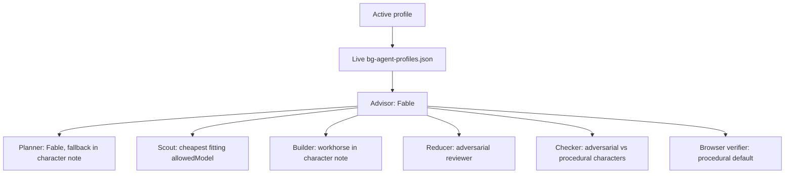

# Pi Meta Harness

A public, portable setup for Nour's preferred Pi advisor, Herdr workspace, model routing, extensions, package pins, and selected skills.

The repository contains configuration and policy only. It does not contain credentials, sessions, memories, machine trust, caches, or advisor runtime state.

## Fresh-machine setup

Install Node.js 22.19 or newer and the host tools first:

```bash
brew install herdr
brew install gentleman-programming/tap/engram
npm install -g @earendil-works/pi-coding-agent@0.84.1
# Install Claude Code through its supported installer, then log in locally.
```

Clone the harness and run one command:

```bash
git clone https://github.com/nourhelmi/pi-meta-harness.git
cd pi-meta-harness
npm run bootstrap
```

The bootstrap command:

1. installs and tests the harness;
2. shows the live install plan;
3. installs the exact browser-verifier CLI and its browser;
4. backs up and installs managed Pi configuration;
5. installs exact Pi package pins, including the public `pi-detach` repository;
6. restores the selected third-party skills;
7. installs Herdr configuration and regenerates its Pi integration;
8. runs the live doctor.

The installer stops if an advisor or worker is active. It never copies credentials or reloads Pi.

After bootstrap, export optional MCP credentials through your shell or secret manager, start Pi inside Herdr, use `/login` for each provider, and run `/advisor`.

## Advisor intelligence map

Switchable profiles. Default `codex-max`. Mid-session: `node ~/.pi/agent/bin/intelligence-profile.mjs <name>`.



| Profile | Implementation | Adversarial review | Procedural |
| --- | --- | ---: | --- |
| `codex-max` | Sol | Terra | Luna |
| `codex-lean` | Sol hard, Sonnet medium, Luna small | Terra | Luna, Sonnet |
| `anthropic-heavy` | Sonnet | Sonnet / Opus | Luna, else Grok |
| `grok-cycle` | Grok | Grok | Sonnet |

Every delegated role requires a concrete completion anchor. Character notes in the active profile are binding. Cursor may only be `cursor/grok-4.6`.

## Repository map

- `extensions/` — first-party advisor extensions and the reviewed `unified-edit.ts` snapshot.
- `skills/` — first-party advisor, worker-role, triage, and graph-driver skills.
- `config/intelligence-profiles/` — named intelligence maps (`codex-max`, `codex-lean`, `anthropic-heavy`, `grok-cycle`).
- `config/bg-agent-profiles.json` — checked copy of `codex-max`.
- `scripts/intelligence-profile.mjs` — mid-session switcher.
- `config/settings.overlay.json` — safe Pi settings and exact package pins.
- `config/mcp.json` — MCP definitions with environment placeholders only.
- `config/skill-sources.json` — selected third-party skills at exact source commits and trees.
- `herdr/` — portable Herdr theme, UI, keybindings, and notification sounds.
- `scripts/meta-harness.mjs` — plan, install, doctor, restore, and skill commands.
- `scripts/bootstrap.sh` — the one-command fresh-machine install.

`pi-detach` stays in its own public repository and is installed from a full Git commit. This harness is the single bootstrap entry that composes it with the rest of the setup.

## Safety and reproducibility

Use a sandbox when you change the harness:

```bash
npm ci
npm test
node scripts/meta-harness.mjs install --target /tmp/pi-meta-harness-test
node scripts/meta-harness.mjs doctor --target /tmp/pi-meta-harness-test
```

Exact versions or full commits pin Pi packages. First-party harness files are copied from this repository. Third-party skills are fetched at full Git commits, verified against recorded tree IDs, copied instead of symlinked, and checked against per-skill SHA-256 hashes. The skills installer CLI is also pinned.

The marketing and fal.ai groups intentionally use the last reviewed revisions that still contain the selected skill names; their newer upstream layouts renamed or removed those skills.

Real Pi targets always require `--live`. Each install creates a restorable backup under:

```text
~/.pi/agent/backups/pi-meta-harness/<timestamp>/
```

Herdr backups are under:

```text
~/.config/herdr/backups/pi-meta-harness-herdr/<timestamp>/
```

Restore with:

```bash
node scripts/meta-harness.mjs restore --live --backup <pi-backup-path>
node scripts/meta-harness.mjs restore-herdr --live --backup <herdr-backup-path>
```

## Credentials

Copy only variable names from [`.env.example`](.env.example). Never commit values. Rotate a credential immediately if it enters a transcript, diff, shell history, or repository.

See [`docs/security.md`](docs/security.md) for the complete portability boundary and [`docs/cutover.md`](docs/cutover.md) for controlled updates to an existing machine.

## License

MIT. Third-party components keep their own licenses and notices; see [`NOTICE.md`](NOTICE.md) and [`config/third-party-extensions.lock.json`](config/third-party-extensions.lock.json).
