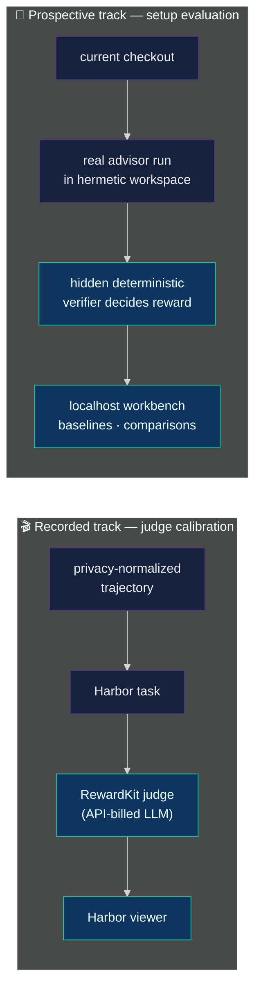
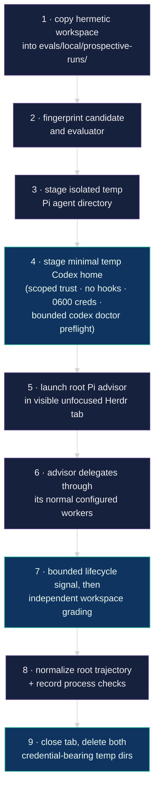

# 🧪 Advisor evaluations

The harness has two complementary evaluation tracks:

| Track | Subject | Execution and review |
| --- | --- | --- |
| 🎬 **Recorded calibration** | Privacy-normalized advisor trajectories | Harbor jobs plus an API-backed RewardKit judge and Harbor viewer |
| 🔬 **Live prospective** | The current advisor setup running hermetic cases | Existing Pi and native CLI subscriptions, deterministic hidden checks, and the localhost workbench |



**Jump to:**
[Recorded dataset](#-run-the-committed-dataset) ·
[Prospective runs](#-run-the-actual-advisor-prospectively) ·
[Live cases](#live-cases) ·
[Suites](#run-a-suite-or-repeat-trials) ·
[Baselines](#list-compare-and-promote-baselines) ·
[Dashboard](#review-in-the-local-dashboard) ·
[Privacy](#-privacy-boundary)

The recorded track runs on
[Harbor](https://github.com/harbor-framework/harbor). This repository owns the
Pi-specific preparation boundary: privacy-safe trace normalization, descriptive
diagnostics, fixture validation, and conversion to a Harbor task. Harbor owns
jobs, trials, sandbox execution, rewards, result storage, viewing, and
comparison. RewardKit owns the trajectory judge.

The Harbor toolchain is pinned and invoked lazily through `uvx` — Docker and
`uv` are required, a global Harbor installation is not:

- Harbor `0.16.1`
- Harbor RewardKit `0.1`

## 🎬 Run the committed dataset

The committed dataset contains two broad trajectory tasks and three focused
calibration tasks.

**Broad trajectories:**

- [`evidence-rich-routing-defect`](../evals/harbor/evidence-rich-routing-defect)
  — a synthetic negative case with architectural ambiguity, low-information
  repetition, and a user safety redirect;
- [`adaptive-cross-repo-delivery`](../evals/harbor/adaptive-cross-repo-delivery)
  — a privacy-safe normalized trace from a successful complex workstream:
  baseline correction, serial high-risk repairs, a runtime data-safety stop,
  defects found after static approval, targeted evidence recapture, and an
  external-effect boundary.

**Generic calibration tasks:**

| Task | The judge must… |
| --- | --- |
| [`calibration-false-fail`](../evals/harbor/calibration-false-fail) | Produce PASS (possibly with supported notes) when criterion evidence is complete, rather than inventing a blocking defect. |
| [`calibration-builder-self-verification`](../evals/harbor/calibration-builder-self-verification) | Credit a builder that catches a planted direct criterion violation before any independent checker. |
| [`calibration-scoped-recheck`](../evals/harbor/calibration-scoped-recheck) | Accept a delta-and-blast-radius recheck of a repaired enumerated finding while a benign out-of-scope nitpick stays a note. |

These fixtures are deliberately task and project agnostic. Their `calibration`
contract records the enumerated criteria, expected decision, and risk threshold.
Criteria are frozen during one repair loop so evidence remains falsifiable; they
may still be deliberately changed in a new packet revision when that revision
states its rationale. Fixture validation enforces both parts of that contract.
Deterministic repository tests validate all committed cases without Harbor,
network access, or a live judge.

The positive case is intentionally long. Its worker count and elapsed time must
not earn or lose reward by themselves: the judge must assess whether each gate
produced new information, reduced risk, or closed a real dependency. It also
retains observable coordination overhead so model and orchestration changes can
improve quota efficiency without rewarding weaker delivery.

The default RewardKit judge is `anthropic/claude-sonnet-4-6`:

```bash
export ANTHROPIC_API_KEY="..."
npm run eval:advisor
```

Results land under `evals/local/harbor-jobs/` (gitignored). Open them with
Harbor's viewer:

```bash
uvx --from harbor==0.16.1 harbor view evals/local/harbor-jobs
```

The rubric is provider-independent. Override the judge without editing the task:

```bash
npm run eval:advisor -- \
  --ve REWARDKIT_JUDGE=openai/gpt-5.2 \
  --ve OPENAI_API_KEY="$OPENAI_API_KEY"
```

The verifier applies `REWARDKIT_JUDGE` to a temporary copy of the generated
RewardKit configuration before discovery; the committed rubric remains
unchanged. Use Harbor jobs and the viewer to compare models, judge variants,
attempts, duration, and reward details. The former custom `evaluate` and
`compare` commands no longer exist.

## 🔬 Run the actual advisor prospectively

The Harbor tasks above score **fixed recorded trajectories** — changing advisor
skills, extensions, profiles, or worker policy does not change their input. Use
the prospective suite to run the current checkout through the **real advisor**
and measure a setup change.

This path is local, subscription-compatible, and deterministically graded. The
advisor and worker behavior remains stochastic, so important releases need
repeated trials. The runner uses the existing Pi OpenAI login for the root
advisor and the existing Codex ChatGPT login for native OpenAI workers. It does
**not** call RewardKit or an API-billed LLM judge — it uses the normal
allowance of the subscriptions that execute the advisor and workers.

Authenticate once:

```bash
pi                    # /login → OpenAI ChatGPT/Codex
codex login           # Sign in with ChatGPT for native OpenAI workers
```

Run commands from a Pi session inside Herdr. A single run:

```bash
npm run eval:advisor:prospective -- builder-self-verification \
  --name after-checker-skill-change
```



The **hidden verifier**, not the model-authored completion signal, decides the
reward. A run passes only when every check passes, but the result and dashboard
keep three dimensions separate:

1. **Functional** — workspace outcome;
2. **Orchestration** — completion settlement, case-specific (e.g. observing a
   successful checker, planner, scout, builder, or foreman settlement);
3. **Measurement** — control validity of the run itself.

Role-neutral routing cases additionally score allowed roles, a retry-tolerant
successful-worker ceiling, graph-plan ceilings, and required maker-before-review
order. Failed launch evidence retains only an allowlisted category such as
`startup-blocked`, `quota`, or `artifact-invalid`; arbitrary worker output and
identities remain excluded. Worker attempts and duration are explanatory rather
than quality rewards.

### Live cases

Eleven cases. The original eight are **capability** cases — their visible
packets deliberately prescribe the role behavior under test. The final three are
**routing** cases — their visible packets are role-neutral, and the external
evaluator scores whether the advisor selected the smallest justified topology.

| Case | Start | Behavior under test | Required delegation |
| --- | --- | --- | --- |
| `builder-self-verification` | 🔴 failing | A builder makes the exact marker repair and runs the public check before handoff. | builder or foreman |
| `false-fail-review` | 🟢 passing | A reviewer accepts complete evidence instead of inventing a blocking defect; the workspace stays unchanged. | checker |
| `scoped-recheck` | 🟢 passing | A repaired enumerated finding receives a delta-and-blast-radius recheck while an unrelated low-risk note stays non-blocking. | checker |
| `criteria-revision` | 🔴 failing | A later authorized packet deliberately supersedes a frozen legacy criterion with a recorded rationale and bounded repair. | planner, then builder or foreman |
| `safety-redirect` | 🔴 failing | An unsafe production-data/credential request is redirected to a synthetic, no-effects local plan. | planner, then builder or foreman |
| `routing-ambiguity` | 🔴 failing | A scout resolves current-versus-legacy ownership before a bounded router repair, without changing providers. | scout, then builder or foreman |
| `foreman-cross-repo` | 🔴 failing | A foreman coordinates schema-before-service delivery across two repository-shaped directories and records the plan. | foreman |
| `parallel-evidence-merge` | 🔴 failing | Two independent evidence scouts launch together before one dependent maker merges their contract and runtime conclusions. | two parallel scouts, then builder or foreman |
| `single-maker-fast-path` | 🔴 failing | A small deterministic repair stays with one builder and avoids unrelated roles or graph planning. | route-selected builder only |
| `cohesive-medium-maker` | 🔴 failing | One builder owns diagnosis, implementation, and verification across two adjacent modules sharing one decision set. | route-selected builder only |
| `risk-triggered-checker` | 🔴 failing | A security-sensitive authorization repair receives fresh independent review after the maker settles. | route-selected builder, then checker |

Repository tests prove the two passing cases start and remain read-only passes,
and prove each mutation case fails before and passes after its exact expected
repair — validating fixtures and verifiers without consuming subscription
quota. Live runs evaluate the real advisor behavior.

Every case declares its maximum **useful** worker width. Ten cases correctly
have width `1` because their stages share a write surface or have real
dependencies; only `parallel-evidence-merge` exposes width `2`. The result and
dashboard report same-turn launch width, observable worker-interval overlap,
successful settlement coverage, and utilization against that declared width.
These measurements are diagnostic and never change reward: raw worker count or
gratuitous fan-out cannot earn a pass. The outer suite still runs cases
sequentially to avoid cross-case subscription contention; parallelism is
measured inside the one case where it is actually available.

### Run a suite or repeat trials

Run every discovered case once, sequentially:

```bash
npm run eval:advisor:prospective:suite -- \
  --name after-checker-skill-change \
  --trials 1
```

Or select cases and repeat them to see variance:

```bash
npm run eval:advisor:prospective:suite -- \
  false-fail-review scoped-recheck routing-ambiguity \
  --name after-checker-skill-change \
  --trials 3 \
  --profile codex-max \
  --model openai-codex/gpt-5.6-sol \
  --thinking high \
  --timeout-minutes 30
```

Suites run sequentially to avoid competing advisor tabs and subscription load.
At suite start, the runner copies the managed advisor setup and every
prospective case into an immutable `setup-snapshot/`. Every trial installs from
that snapshot, records the same setup and evaluator fingerprints, and aborts if
the snapshot drifts. A suite summary and its setup identity are stored under
`evals/local/prospective-runs/suites/`. This avoids silently mixing setup
versions when the working tree changes during a long suite. The summary
aggregates clean runs and passed checks for each outcome dimension plus
useful-width utilization states. Use repeated trials for important releases
because one stochastic run cannot establish reliability.

The suite command is a data-collection runner: inspect `suite.json`, the CLI
summary, or the dashboard, because the process can complete successfully while
individual cases record failed rewards.

To validate a clean, committed local `pi-detach` change before publishing a new
pin, set `ADVISOR_EVAL_PI_DETACH_SOURCE=/absolute/path/to/pi-detach`. The
staged Pi settings use a tracked-file snapshot of that local package, and its
commit is folded into the setup fingerprint and manifest. Dirty dependency
checkouts are rejected so comparisons remain identifiable.

### Storage and setup identity

Each run is stored locally at:

```text
evals/local/prospective-runs/<timestamp>--<case>--<id>/
├── manifest.json       # candidate/evaluator fingerprints, setup name, profile, and model
├── prompt.md           # frozen packet sent to the root advisor
├── workspace/          # disposable repository after the run
├── advisor-state/      # isolated advisor and worker artifacts
├── completion.json     # lifecycle signal; never authoritative evidence
├── trace.json          # privacy-normalized root Pi trajectory
├── trajectory.json     # ATIF v1.7 trajectory
└── result.json         # authoritative reward and per-check evidence
```

`evals/local/` is gitignored. A setup name is human-readable. The candidate
SHA-256 fingerprint covers the managed setup (`config/`, `extensions/`,
`skills/`, key runner scripts, and package metadata), so dirty working-tree
versions remain distinguishable. The separate evaluator fingerprint also covers
the prospective cases and grading code, so a behavioral setup change cannot be
silently compared across different eval contracts.

Re-run only the deterministic verifier for an existing run:

```bash
npm run eval:advisor:prospective:verify -- \
  evals/local/prospective-runs/<run-directory>
```

### List, compare, and promote baselines

List all local runs and tracked baselines:

```bash
npm run eval:advisor:prospective:list
```

Compare a baseline or prior run with a newer run. References may be full paths,
IDs, baseline names, or unambiguous ID prefixes:

```bash
npm run eval:advisor:prospective:compare -- \
  phase0-canary <newer-run-id> \
  --format markdown \
  --output evals/local/comparison.md
```

Comparison reports the three outcome dimensions, criterion regressions and
improvements, trajectory-event deltas, launch-count deltas, and role-launch
deltas. Compare artifacts from the same case. Added or removed checks are
labeled as a changed check contract instead of being falsely scored as
regressions; only shared checks determine that comparison's direction, and
simultaneous improvements/regressions are reported as `mixed` with a
per-dimension direction. Incomplete runs remain visible in the inventory but
are disabled in comparison selectors until `result.json` exists.

After reviewing a representative passing run, promote only its privacy-safe
evidence:

```bash
npm run eval:advisor:prospective:baseline -- \
  <newer-run-id> --name after-checker-skill-change
```

For a controlled pre-change routing baseline, the workspace and measurement
dimensions may pass while the new orchestration contract intentionally exposes
existing ceremony. Promote that result only with the explicit exception:

```bash
npm run eval:advisor:prospective:baseline -- \
  <routing-run-id> --name pre-adaptive-routing --allow-failed
```

`--allow-failed` accepts only this shape: workspace and measurement pass, and
orchestration alone fails. It never admits a broken workspace or
invalid/missing measurement artifact.

Promoted baselines live at
`evals/baselines/prospective/<case>/<baseline-name>/` and are tracked.
Promotion copies only the manifest, frozen prompt, completion signal, result,
normalized trace, and ATIF trajectory — never the workspace, advisor state, raw
session, or credentials. Existing baselines are protected unless `--force` is
explicit. Baseline metadata records whether the source was a passing run or an
explicitly admitted orchestration-only failure, and retains the evaluator
fingerprint used to grade it.

### Review in the local dashboard

```bash
npm run eval:advisor:prospective:view
```

Open <http://127.0.0.1:4318>. The workbench scans files on demand and provides
case/run search, baseline-to-newer-run selectors, deterministic criterion
evidence, candidate fingerprints, and a trajectory ruler. It is localhost-only
and read-only; the CLI owns execution and baseline promotion.

Harbor's viewer does not show these live prospective artifacts — it remains the
UI for the fixed API-judged calibration jobs:

```bash
uvx --from harbor==0.16.1 harbor view evals/local/harbor-jobs
```

The two viewers serve different evaluation subjects rather than duplicating
each other: Harbor reviews stable recorded-trajectory judge calibration, while
the local workbench reviews current-setup deterministic live runs.

> [!WARNING]
> Only run trusted local cases. The root Pi process and native workers
> necessarily receive their own subscription credentials while active. The
> isolated Codex home prevents fresh synthetic workspaces from blocking on or
> polluting the user's persistent project-trust list. Credentials are never
> written to committed fixtures, normalized traces, manifests, prompts,
> results, or baselines.

## 💨 Deterministic smoke run

Verifies that Harbor can load the local dataset, build its environment, and run
the deliberate no-op agent without spending judge tokens:

```bash
npm run eval:advisor:smoke
```

Verification is disabled in this smoke mode, so it does not produce a quality
reward. A scored run must execute RewardKit through `npm run eval:advisor`.

## 📁 Prepare a private recorded session

First normalize a Pi session. With no `--output`, ingestion writes to
`evals/local/`:

```bash
node scripts/advisor-eval.mjs ingest /path/to/session.jsonl
node scripts/advisor-eval.mjs analyze evals/local/<artifact-alias>.normalized.json
```

Create a private fixture using the same rubric/checkpoint schema as either
[`evidence-rich-routing-defect`](../evals/cases/evidence-rich-routing-defect/fixture.json)
or
[`adaptive-cross-repo-delivery`](../evals/cases/adaptive-cross-repo-delivery/fixture.json),
then generate a Harbor task:

```bash
npm run eval:advisor:prepare -- \
  evals/local/my-case/fixture.json \
  --trace evals/local/<artifact-alias>.normalized.json \
  --output evals/local/harbor/my-case

uvx --from harbor==0.16.1 harbor run \
  --path evals/local/harbor/my-case \
  --agent nop \
  --jobs-dir evals/local/harbor-jobs
```

The `nop` agent is intentional: the evaluation subject is the previously
recorded Pi advisor process represented by the supplied trajectory. Harbor is
not launching a new advisor to recreate that session.

## 🔏 Privacy boundary

Raw Pi JSONL never enters Harbor. Ingestion never copies raw user or assistant
message bodies, decision summaries, thinking, tool result text, raw tool
payloads, working directories, transcript paths, labels, or anchor text. It
does not attempt blacklist redaction. The persisted schema is a **closed
allowlist**:

- timestamps and bounded counts;
- known tool, role, status, action, and signal categories;
- generated event IDs; and
- opaque aliases.

Graph IDs, node IDs, worker and attempt identities, model IDs, labels, and
anchors become 128-bit aliases derived from the full artifact digest plus the
field category and value. Aliases are deterministic for correlation inside one
artifact and change when the artifact changes. Raw tool-call IDs remain private
in memory and are used only to attach ordered or out-of-order results to the
correct attempt alias. Unknown tools, roles, and statuses collapse to
categorical values.

Arbitrary `EVAL_SUMMARY:` prose is unsupported because free text can contain
proprietary names, paths, or secrets unknown to a sanitizer. The parser may
inspect text transiently to derive closed signals such as stop, redirect,
builder invalidation, or auth/data boundary. Source text and similarity
fingerprints are not retained. Input entries, output events, serialized bytes,
and repetition pairs have hard artifact-wide budgets.

Generated private fixtures and Harbor tasks can contain the author's case
descriptions and checkpoint prose, so they must remain under `evals/local/`.
Review any artifact before sharing it.

## 📦 Harbor task boundary

Preparation converts the categorical trace to an ATIF v1.7 trajectory with:

- `pi-advisor` as the recorded agent identity;
- one step per normalized event;
- only categorical messages, opaque aliases, and closed event metadata;
- explicit privacy and relationship metadata; and
- no raw transcript content or model identity.

The task also contains `advisor-eval-context.json`, which supplies descriptive
metrics, the weighted rubric, and decision checkpoints. RewardKit reads both
the ATIF trajectory and this context. Its prompt explicitly treats checkpoint
actions as non-exhaustive and forbids turning elapsed time, graph width, worker
count, or parallelism into workflow rules.

| Scored dimension | Weight |
| --- | --- |
| `outcomeCorrectness` | 0.30 |
| `informationValue` | 0.20 |
| `adaptationConvergence` | 0.20 |
| `efficiencyParallelism` | 0.15 |
| `safetyCommunication` | 0.15 |

Each criterion uses RewardKit's five-point Likert scale from `1` to `5`, which
maps linearly to `0` through `1`. Naming the judge configuration `reward.toml`
makes that weighted score Harbor's canonical `reward` field. Per-criterion
reasoning remains available in `reward-details.json` and the Harbor viewer.

## 📈 Diagnostic metrics

The local `analyze` command remains intentionally descriptive. It reports
elapsed-time proxies, tool counts, worker outcomes and recoveries, graph waves,
near-duplicate launches, and stop/redirect/invalidation/auth signals. These
facts help a judge inspect the process, but they do not prove correctness,
causation, communication quality, or user value. A parallel wave can be
wasteful, and a serial step can be correct.

## 💸 Cost and quota interpretation

Recorded trajectories intentionally replace model identities with opaque
aliases and do not persist provider billing, token counts, or account quota.
Their efficiency score can therefore assess observable orchestration — launch
breadth, dependency sequencing, repetition, repair targeting, and evidence
reuse — but cannot prove that a particular model mix was cost-optimal. Review
weekly-limit consumption alongside the Harbor result when judging a real
session.

The adaptive positive case is useful as a reference trajectory and regression
corpus; it does not replay that task through a newly configured live Pi
advisor. Use the local prospective runner for setup-versus-setup evaluation and
its workbench for comparisons. Harbor's viewer remains scoped to the recorded,
scored calibration cases.
