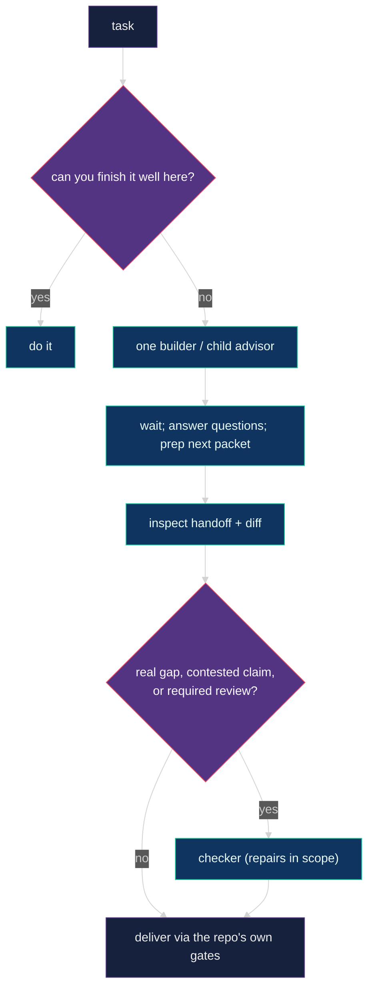

# 🧭 Isolated advisor runtime

The advisor is a technical lead with agency to plan, implement, verify and delegate as
useful. It coordinates helper sessions through per-repository state under
`~/.advisor/<repo-key>/`, resolved from the git common directory so all worktrees of one
repository share one root and no repository carries personal runtime files.
`advisor_session_init` reports the resolved root; `ADVISOR_STATE_DIR` overrides it for
tests. The canonical event translation for this runtime is specified by the
[Pi host binding](advisor-protocol.md#pi-host-binding). The one-maker hook adapters are
specified by the [Claude Code host binding](advisor-protocol.md#claude-code-host-binding)
and the [Codex host binding](advisor-protocol.md#codex-host-binding). Protocol step 6 adds
manifest-backed graph correlation to every host; Pi is the reference implementation for
wave completion, BLOCKED reply, cancellation, and node resume. Pi cancellation receipt is
a silent shared-bus observation: `parent.awakened` records durable parent-host receipt
and does not imply that a model response started.

## 📏 Runtime rules

1. Start every independent root advisor from an ordinary Pi session with `advisor_launch`; it creates a new Herdr tab, never a pane split. A manually opened advisor may invoke `/advisor` in its own fresh tab.
2. `advisor_session_init` creates or claims one isolated workstream, persists one worker mode (`pi` or `native`), trims the session's active tool set, and returns the workstream hot section. The root advisor remains Pi in both modes.
3. The advisor session extension injects the doctrine core and routing policy into the system prompt on every turn, and re-sends the workstream hot section after every compaction. With no enabled external agent router it also injects the compact live intelligence guide; with routing enabled the router policy replaces that guide and advisors omit `model`/`thinking` unless the user pins a model. When a root advisor settles idle with detached runs outstanding and at least 120k context tokens on a provider whose compaction request shares the prompt cache (OpenAI Codex), the extension compacts immediately so the wake-up does not re-bill the whole conversation; `ADVISOR_WAIT_COMPACTION=off` disables it and `ADVISOR_WAIT_COMPACTION_MIN_TOKENS` moves the threshold. Situational references under `skills/advisor/references/` are read only when needed.
4. Each live root advisor uses a different workstream. A child owns a bounded outcome under its parent and launches only through `bg_agent` with `role: "advisor"`; its settlement is the parent completion channel.
5. Within advisor state, an advisor writes only its own session record, its owned workstream record, new immutable events, and unique run output. Product edits follow the assigned checkout boundary.
6. Legacy in-repo `.advisor/` directories are read-only history. Ownership transfers with an immutable handoff event.
7. Intercom is only for coordination between independent peer sessions, never for parent-child progress or completion.
8. Delegated LLM work launches only through `bg_agent`: a configured role, or freeform with no role when the task fits none. Workers remain panes in the owning advisor tab; `bg_run` is for shell commands. Pi mode runs selected identities through Pi; native mode maps OpenAI identities to Codex CLI and Anthropic identities to Claude Code. Freeform workers always run through Pi.
9. Every role launch carries a done-when line (`anchor`, or a few `acceptance` lines). Packets are short: goal, decided versus suggested, write surface, done-when, evidence paths, stop conditions. Freeze decisions, safety and ownership, never tool versions or command order.
10. One writer owns a checkout at a time, including parent and child advisors. Settle a writing worker before reclaiming its surface. Parallel makers need separate worktrees: `node ~/.pi/agent/bin/advisor-worktree.mjs add <path> -b <branch>` registers one and copies the untracked `.env*` files, and the runtime admits any worktree Git lists for the repository, including ones added after the advisor started. Makers commit on their branch as they go; the tested revision is a commit.
11. Pane labels use `advisor · <purpose>` for advisor roots and `role · <purpose>` for workers. Successful worker panes close automatically; blocked or unknown panes stay visible. Keep a worker alive only for a planned follow-up.
12. Makers prove their own work and exercise plausibly affected browser journeys; checker repairs carry the same duties. Required agentic PR review belongs to the project's review/CI workflow, not a mandatory local checker.
13. Global advisor routines stay paused because open Pi processes share routine state.

## Blocked signals

Blocking Pi UI prompts (question, select and confirm dialogs) mark the Herdr pane blocked.
These are actual interaction boundaries: never type through a permission or credential
dialog as an ordinary worker reply.

In the managed runtime, a `BLOCKED` result is a report claim, not the execution
completion signal. A completed turn can leave an unresolved product question; the caller
reads that claim and chooses the next action. The legacy backend still maps artifact
`BLOCKED` to its pane signal. Pi artifacts are discovered through the profile's
`resultDiscovery` session entry.

Blocked means a missing product decision, a permission, a credential, or an external
action only the user can perform. Everything else between a worker and its outcome is an
obstacle (tool versions, a missing optional dependency, a pre-existing failure on an
untouched file, a misnamed skill, a placeholder file) that the worker clears locally and
records under `Deviations`; the advisor reviews deviations after settlement. A safety
boundary the packet names is not an obstacle.

## 🪜 Adaptive topology

Three routes: direct work, one maker, several makers. Direct work is the default for
anything the advisor can finish well itself. One empowered maker (a builder or a child
advisor) owns cohesive work that benefits from fresh context or parallelism. Several
makers exist only for genuinely independent ownership, each in its own worktree. There
are no scout, planner or reducer presets; advisors, builders and checkers all
investigate, plan, implement and verify within their scope.

While a maker runs, the advisor waits: it answers the maker's questions and prepares the
next packet. It does not shadow-implement, rerun the maker's checks or write parallel
evidence. On settlement it inspects the handoff and the diff and reruns only what
resolves a real gap. A worker PASS is a claim, not proof; a missing summary is not a
failed run.

The graph tool rejects malformed structure, cycles, and invalid `maxParallel` bounds and
computes deterministic waves. Writer coordination is advisor policy, not a runtime
admission gate. Checker nodes without maker ancestors produce non-blocking warnings.

## 🔍 Review

Verification depth follows consequence, not a tier table. Auth, money, data loss,
security, concurrency and external effects get failure-path probes; docs and mechanical
changes get the affected check. The advisor decides on its own whether independent eyes
are worth it; the doctrine does not prescribe review stages.

Checkers are repair-first: they fix every finding they can inside the reviewed surface,
rerun the affected checks and browser journeys, commit, and report the post-repair state.
They return, not repair, what needs a product decision, an unauthorized schema or
migration change, or an external effect. Their assessment of the original work is
independent; their own patch is self-verification. Stop a repair loop when another round
would repeat the same strategy without new information; report what remains with a
recommendation. Deliver through the
repository's documented checks, CI and required PR review for the delivered revision;
do not invent review the repository does not require, and do not skip review it does.

Browser verification follows impact, not filenames: trace the change to its consumers,
exercise the affected journeys against the integrated application with a relevant
persona and failure path, and reuse project browser tests that cover the flow. Pure API
tests, mocked components and screenshots alone do not prove browser behavior. Internal
changes with no browser consumer need the relevant unit or integration checks and a
one-line rationale. See the
[worker contract](../skills/advisor-worker/references/WORKER_CONTRACT.md#verify-the-affected-journeys).

## 🎭 Roles and intelligence

Configured roles are `advisor`, `builder`, and `checker`. A child advisor uses the same
installed doctrine and intelligence guide as the root, scoped to one parent outcome; it
may implement directly, use specialists, or delegate further. The runtime supplies
validated ancestry and a separate graph namespace, not a new top-level workstream. The
delegation flag grants the builder at most one optional read-only review helper.
Workers load their own role skill and contract; the advisor does not preload them.

[`../config/bg-agent-profiles.json`](../config/bg-agent-profiles.json) is fixed semantic
role configuration: role skill and portable skill path, anchor requirement, and an
advisory cycle cap. It contains no model policy and is never changed by intelligence
switching.

| Mode | Transport |
| --- | --- |
| `pi` | `bg_agent` starts Pi and forwards the selected provider/model/reasoning. |
| `native` | `openai-codex`/`openai` route to Codex CLI; `claude-bridge`/`anthropic` route to Claude Code. The launcher reserves a durable result path; the report is an optional handoff, not a completion gate. |

The advisor profile is constrained to `harness: "pi"`. Launch, reply and task accounting
impose no lifetime quotas. Descendant cancellation is downward. A child advisor whose
turn ends without a terminal report while its descendants are live is held open and
settles on its final turn; the parent sees a progress note in between.

Without an enabled external router, named guides in [`../config/intelligence-profiles/`](../config/intelligence-profiles/)
are the advisor's source of model character and ordered role recommendations. Install
copies them to `~/.pi/agent/intelligence-profiles/` and materializes the active guide as
`~/.pi/agent/advisor-intelligence.json`, rendered into the system prompt every turn.
Switch with `node ~/.pi/agent/bin/intelligence-profile.mjs <name>`; the default is
`codex-max`. Recommendations are advisory: the advisor picks the best model and reasoning
for the task from or outside the guide, and an outside-guide choice needs only a concise
rationale when material. Deep dive: [`intelligence-profiles.md`](intelligence-profiles.md).

An external `@nourhelmi/agent-router` installation is opt-in through trusted host config at
`~/.config/agent-router/config.json` (or `AGENT_ROUTER_CONFIG`). Missing or
`{"version":1,"enabled":false}` config preserves guide-driven behavior byte-for-byte.
Enabled config names one absolute `modulePath`; invalid config/module is a launch error,
never a fallback. The router owns only model/thinking selection after the runtime validates
the public request and resolves role/harness policy. A caller-supplied model, with optional
thinking, is passed as a mandatory pin. Router identity and decision ID are persisted in the
execution packet and exposed in launch responses/status; the canonical launch event records
the exact selected model and thinking. Fresh/followup input requires an acknowledged
renewal; an expired lease never reroutes or resurrects. The runtime retains capacity across
blocked/in-progress/uncertain work and through terminal idle turns for `keepAlive` workers.
Non-kept terminal turns release; kept workers release only after confirmed stop/closure.
Lease loss interrupts the owned worker when possible and becomes recovery-required, never
silent unreserved execution. See [lease lifetime and idle-worker cleanup](pi-detach-runtime-bridge.md#optional-external-agent-router).

## 🧠 Session context

The advisor's standing context is small by construction: the doctrine core, either the
compact live guide or the authoritative external-router policy, the workstream hot section
(everything above `## Log`, about sixty lines, returned by `advisor_session_init` and after
every compaction), and a trimmed tool set. References under `skills/advisor/references/`
(graphs, model routing, transport and settlement, team) are read only when their
situation arises.

## 🚦 Start

From an ordinary Pi session inside Herdr, call `advisor_launch` with the target `cwd`
and, when known, a concise `workstream`, `purpose`, and `workerHarness`. The tool creates
an unfocused Herdr tab labelled `advisor · <purpose>`, starts Pi there, and sends
`/skill:advisor-pi` or `/skill:advisor-native` when the mode is explicit; otherwise the
new advisor uses `/skill:advisor` and asks in the UI. The new advisor calls
`advisor_session_init` as its first action and delegates any child advisor through
tracked `bg_agent` settlement rather than launching another root. For a tab opened
manually, invoke `/advisor`, `/skill:advisor-pi` or `/skill:advisor-native` directly.
