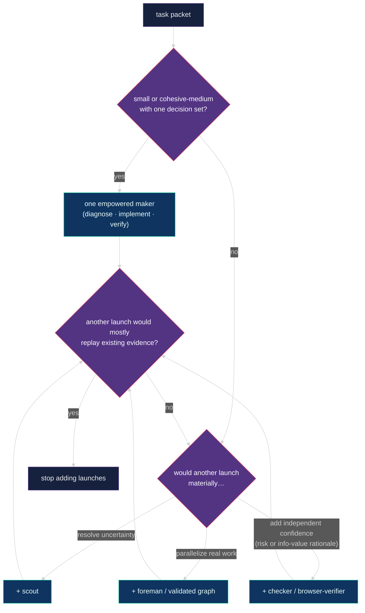

# 🧭 Isolated advisor runtime

The advisor coordinates parallel Pi sessions through per-repository state under
`~/.advisor/<repo-key>/`, resolved from the git common directory so all
worktrees of one repository share one root and no repository carries personal
runtime files. `advisor_session_init` reports the resolved root;
`ADVISOR_STATE_DIR` overrides it for tests.
The canonical event translation for this runtime is specified by the
[Pi host binding](advisor-protocol.md#pi-host-binding).

## 📏 Runtime rules

1. Launch every separate advisor with `advisor_launch`; it creates a new Herdr tab with `--no-focus`, never a pane split. A manually opened advisor may still invoke `/advisor` in its own fresh tab.
2. `advisor_session_init` creates or claims one isolated workstream and persists one worker mode: `pi` or `native`. The root advisor remains Pi in both modes.
3. Each live advisor must use a different workstream.
4. An advisor writes only its own session record, its owned workstream record, new immutable events, and unique run output.
5. Treat legacy in-repo `.advisor/` directories as read-only history.
6. Transfer ownership with an immutable handoff event.
7. Use Intercom for short conclusions and paths, not transcripts or raw logs.
8. Launch delegated LLM work only through `bg_agent` — usually a configured semantic role, or freeform with no role when the task fits none. Workers remain panes in the owning advisor tab; use `bg_run` for shell commands. Pi mode runs selected identities through Pi. Native mode maps OpenAI identities to Codex CLI and Anthropic identities to Claude Code. Freeform workers always run through Pi.
9. Every role launch needs concrete acceptance criteria (enumerated falsifiable claims, or a single anchor for trivial nodes) and a bounded result file. Give makers every known threat-model and risk invariant before implementation. Makers own cohesive diagnosis, implementation, task-shaped tests, and ordinary browser exercise; checkers, when justified, audit the same contract and high-value evidence with scoped verdicts. Every packet declares a risk tier (Low, Standard, High) that fixes the review route and the checker FAIL bar, links evidence by path rather than paraphrase, and phrases criteria as failure probes. Makers explore freely and deliver narrowly: they may propose criteria and report adjacent defects, and the advisor accepts proposals through a recorded packet revision.
10. Use the graph planner as a structural validator/linter and coordination aid before three or more nodes or mixed parallel and dependent work, but create a graph only for real independent ownership or dependency boundaries.
11. Parallel builders require explicit approval and separate worktrees.
12. Pane labels use `advisor · <purpose>` for advisor roots and `role · <purpose>` for workers, without run-id suffixes. Successful worker panes close automatically; blocked or unknown panes stay visible.
13. Keep a builder alive only for a planned bounded repair. Makers run one fresh-context review of their own diff before handoff on Standard and High packets; that is maker evidence, not independent review. Every checker starts fresh, judges against the packet tier's FAIL bar, and repairs small qualifying findings inline in any round, including repair rounds.
14. Keep global advisor routines paused because open Pi processes share routine state.

## Blocked signals

Every blocking Pi UI prompt, including the question tool and select or confirm
dialogs, marks its Herdr pane blocked through the bridge extension. When a
worker's `result.md` Status starts with `BLOCKED`, the pane is marked blocked as
the turn ends, so the parent `bg_agent` settles it as blocked and the request
sound fires. Pi-detach discovers Pi worker result artifacts through the
`advisor-worker` session entry declared by the profile's `resultDiscovery`
field.

## 🪜 Adaptive topology

For small and cohesive-medium work with one decision set, presume **one
empowered maker** rather than automatically splitting scouting, planning,
building, tests, or browser exercise. This is a
presumption against ceremony, not a target worker count.

Optimize marginal evidence value and critical-path latency: add a foreman,
graph, checker, browser verifier, or freeform worker whenever it materially
resolves uncertainty, parallelizes real work, or adds useful independent
confidence. Foremen require useful depth-1 delegation; graphs require genuine
ownership or dependency boundaries; dedicated checkers and browser verifiers
require a risk or information-value rationale.
Stop adding launches when another would mostly replay existing evidence.

Makers prove every criterion with task-shaped command evidence. The advisor
inspects it and chooses the smallest independent authoritative rerun
appropriate to cost, risk, and oracle strength. Optional checkers independently
probe the critical or contested evidence rather than replaying every command.
Delivery runs the repository's actual required merge or CI gates once, without
unrelated repository-wide sweeps. New evidence that changes success criteria
requires an explicit recorded packet revision, never a hidden stricter checker
contract.

The planner rejects malformed structure, cycles, invalid concurrency, and
unsafe parallel-builder checkout conflicts. Checker or browser nodes without
builder ancestors and reducers with low fan-in produce non-blocking warnings
instead: baseline browser investigation, checker audits, and small reduction
shapes can be intentional. Warnings are stored in the immutable graph manifest
and tool details so the advisor can confirm intent without manufacturing
dependencies or relabeling work. Execution waves remain deterministic DAG
output; deciding whether each node has enough information value remains the
advisor's job.

## 🎚️ Risk tiers

Every packet carries one tier, decided from what the change touches and
recorded with its evidence before launch. Unknown coupling selects the higher
tier, and a repository `AGENTS.md` may carry a `## Risk tiers` path map that
wins over the defaults.

| Tier | Covers | Route | Checker FAIL bar |
| --- | --- | --- | --- |
| Low | docs, skills, prompts, specs, mechanical config, tests-only, one-file repair with a strong oracle | one maker, deterministic criteria, no checker | violated criterion only |
| Standard | product runtime code with coupling or a weak oracle | one maker with fresh review; checker only on a Checker economy trigger | violated criterion or unrepaired High finding |
| High | schema, migration, auth, RLS or security, privacy, money, idempotency, destructive or external effects, concurrency, gate code | one maker with fresh review, one checker, browser verifier when visible | violated criterion or unrepaired Medium-or-higher finding |

Finding severity is graded separately: High violates a risk invariant,
criterion, or security, data, money, auth, or destructive boundary; Medium is a
bounded correctness defect in the changed surface; Low is everything else.

## 🎭 Roles and intelligence

Configured roles are `scout`, `planner`, `reducer`, `builder`, `foreman`,
`checker`, and `browser-verifier`; a meta-owned Pi launch flag grants depth-1
visible subagents — to the foreman for bounded delegation and to the builder
for exactly one fresh-review subagent — and every granted subagent inherits the
full no-further-delegation prohibition. The generic transport profile merely
forwards that flag.
[`../config/bg-agent-profiles.json`](../config/bg-agent-profiles.json) is fixed
semantic role configuration: the instructed role skill and portable skill path,
anchor requirement, and instructional cycle cap. It contains no model or
reasoning policy and is never changed by intelligence switching.

The persisted worker mode is the default for every configured role launch and
is authoritative over conflicting per-launch requests. A generic profile-level
`harness` constraint takes precedence when a role depends on one runtime. It
changes transport, not roles or intelligence policy:

| Mode | Transport |
| --- | --- |
| `pi` | `bg_agent` starts Pi and forwards the selected provider/model/reasoning. |
| `native` | `openai-codex`/`openai` route to Codex CLI; `claude-bridge`/`anthropic` route to Claude Code. Native workers receive an automatically generated durable result path under the advisor state root, reserved before launch. A successful settlement requires a nonempty artifact with the role-result headings; a section may be organized into deeper subheadings (for example `## AC1` under `# Claims`), and only a section with no prose under it is empty. Otherwise the run becomes `stalled`, its pane remains visible, and the settlement notice names the validation problem so the parent can repair the artifact by name instead of relaunching the work. |

The foreman profile is constrained to `harness: "pi"`, including in an advisor
session whose other workers use native Codex/Claude. Its delegation permission
is a separate advisor-worker CLI flag; pi-detach remains unaware of foreman or
delegation semantics.

Every shipped intelligence profile remains usable in either mode, but a
specific recommendation is native-routable only when its provider maps to Codex
or Claude. Cursor/Grok has no provider-native route in this two-harness mode.
The advisor chooses a task-fit OpenAI/Anthropic recommendation from the same
active guide or reports the mismatch rather than silently changing the session
mode.

Named guides in
[`../config/intelligence-profiles/`](../config/intelligence-profiles/) are the
advisor's source of model character and ordered role recommendations. Install
copies them to `~/.pi/agent/intelligence-profiles/` and materializes the active
guide as `~/.pi/agent/advisor-intelligence.json`. Switch mid-session with
`node ~/.pi/agent/bin/intelligence-profile.mjs <name>`. The default is
`codex-max`.

Recommendations are advisory, not exhaustive or enforceable. The advisor
chooses the best model and reasoning for the task from or outside the guide,
using fit, capability, cost, quota, and availability as judgment inputs. An
outside-guide choice needs only a concise rationale when material and never
permission merely for being unlisted. Worker launch and task execution do not
reject an outside-guide or changed identity; manifests retain launch and
current identity for audit. Quota is not polled — you pick the guide.

Deep dive (topology, spend, pick tree, recommendations, `/advisor` vs
switcher): [`intelligence-profiles.md`](intelligence-profiles.md).

## 🚦 Start

From any Pi session running inside Herdr, call `advisor_launch` with the target
`cwd` and, when known, a concise `workstream`, `purpose`, and `workerHarness`.
The tool creates an unfocused Herdr tab, labels its root pane
`advisor · <purpose>`, starts Pi there, and sends `/skill:advisor-pi` or
`/skill:advisor-native` when the mode is explicit. If it is omitted, the new Pi
advisor uses `/skill:advisor` and asks in the UI. The new advisor still calls
`advisor_session_init` as its first action.

For a tab opened manually, invoke `/advisor` or `/skill:advisor` to choose the
mode interactively, or invoke `/skill:advisor-pi` / `/skill:advisor-native` to
choose directly. Enter a short workstream name if Pi asks. Do not use a pane
split for a separate advisor. No advisor shell launcher is required.
