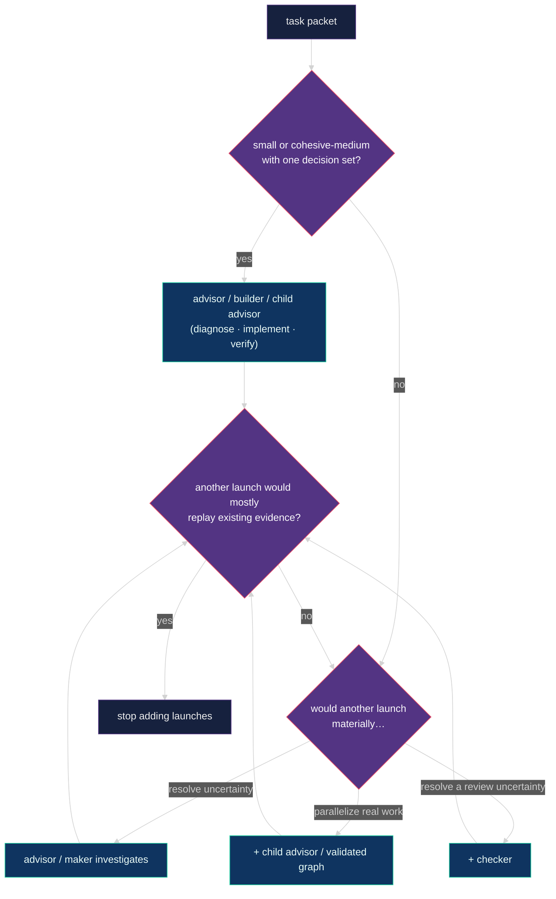

# 🧭 Isolated advisor runtime

The advisor is a technical lead and orchestrator with agency to plan, implement,
verify, and delegate as useful—not an obligation to do everything itself. It
coordinates helper sessions through per-repository state under
`~/.advisor/<repo-key>/`, resolved from the git common directory so all
worktrees of one repository share one root and no repository carries personal
runtime files. `advisor_session_init` reports the resolved root;
`ADVISOR_STATE_DIR` overrides it for tests.
The canonical event translation for this runtime is specified by the
[Pi host binding](advisor-protocol.md#pi-host-binding). Claude Code's standalone
one-maker hook adapter, installation, capability verdicts, and foreground-only
boundary are specified by the
[Claude Code host binding](advisor-protocol.md#claude-code-host-binding).
Codex CLI's hooks-only one-maker adapter, installation, native SubagentStop
delivery boundary, and capability verdicts are specified by the
[Codex host binding](advisor-protocol.md#codex-host-binding).
Protocol step 6 adds manifest-backed graph correlation to every host; Pi is the
reference implementation for wave completion, BLOCKED reply, cancellation, and
node resume. Pi cancellation receipt is a silent shared-bus observation:
`parent.awakened` records durable parent-host receipt and does not imply that a
model response started; pi-detach's killed state ends supervision, not the
native agent process.

## 📏 Runtime rules

1. Start every independent root advisor from an ordinary Pi session with `advisor_launch`; it creates a new Herdr tab with `--no-focus`, never a pane split, and is removed after advisor initialization. A manually opened advisor may still invoke `/advisor` in its own fresh tab.
2. `advisor_session_init` creates or claims one isolated workstream, persists one worker mode (`pi` or `native`), trims the session's active tool set, and returns the workstream hot section. The root advisor remains Pi in both modes.
3. The advisor session extension injects the doctrine core (`skills/advisor/doctrine.md`) and a compact rendering of the live intelligence guide into the system prompt on every turn, and re-sends the workstream hot section after every compaction. When a root advisor settles idle with detached runs outstanding and at least 120k context tokens on a provider whose compaction request shares the prompt cache (OpenAI Codex), the extension compacts immediately so the wake-up does not re-bill the whole conversation; `ADVISOR_WAIT_COMPACTION=off` disables it and `ADVISOR_WAIT_COMPACTION_MIN_TOKENS` moves the threshold. The advisor reuses the injected doctrine and guide; other skill and contract reads follow the decision-driven policy under Roles and intelligence, and situational references under `skills/advisor/references/` are read only when needed.
4. Each live root advisor must use a different workstream. A child owns a bounded outcome under its parent and launches only through `bg_agent` with `role: "advisor"`; its normal settlement is the parent completion channel.
5. Within advisor state, an advisor writes only its own session record, its owned workstream record, new immutable events, and unique run output. Product edits follow the assigned checkout boundary, not this state-only restriction.
6. Treat legacy in-repo `.advisor/` directories as read-only history.
7. Transfer ownership with an immutable handoff event.
8. Intercom is only for coordination between independent peer sessions: never use it for parent-child progress or completion, which belongs to tracked `bg_agent` settlement.
9. Launch delegated LLM work only through `bg_agent` — usually a configured semantic role, or freeform with no role when the task fits none. Workers remain panes in the owning advisor tab; use `bg_run` for shell commands. Pi mode runs selected identities through Pi. Native mode maps OpenAI identities to Codex CLI and Anthropic identities to Claude Code. Freeform workers always run through Pi. A launch whose prompt still contains an unexpanded paste placeholder is rejected.
10. Every role launch needs concrete acceptance criteria (enumerated falsifiable claims, or a single anchor for trivial nodes). A useful summary is an optional handoff unless explicitly requested as a deliverable. The quick packet is the default: goal, write surface, failure probes, evidence paths, one risk-tier line and material stop conditions. Freeze criteria, safety, ownership and locked decisions—not incidental tool versions, directory modes or literal command order. Makers may propose sharper criteria; the advisor records deliberate contract revisions.
11. Use an optional graph for real ownership or dependency boundaries. It records coordination and evidence, not permission to execute or a mandatory stage based on worker count.
12. One writer owns a checkout at a time, including parent and child advisors. Settle a writing worker before reclaiming its surface. Parallel makers need separate worktrees and must respect explicit user limits. Independent review names the revision it assessed.
13. Pane labels use `advisor · <purpose>` for advisor roots and `role · <purpose>` for workers, without run-id suffixes. Successful worker panes close automatically; blocked or unknown panes stay visible.
14. Keep a worker alive only for a useful planned follow-up. Makers prove criteria, inspect their own diff and exercise plausibly affected browser journeys; checker repairs have the same duties. Extra review needs a named uncertainty or project/user requirement, not a Standard/High label. Required agentic PR review belongs to the project's review/CI workflow, not a mandatory local checker. A checker assesses the assigned work and repairs in-scope findings; repairs do not automatically require a non-author or another checker. Auto-fixable mechanical findings are repaired inline; a formatter or lint pass is never an acceptance criterion on its own.
15. Keep global advisor routines paused because open Pi processes share routine state.

## Blocked signals

Blocking Pi UI prompts, including question, select and confirm dialogs, mark the
Herdr pane blocked. These are actual interaction boundaries: never type through a
permission or credential dialog as an ordinary worker reply.

In the managed runtime, a `BLOCKED` result is a report claim, not the execution
completion signal. A completed turn can leave an unresolved product question; the
caller reads that claim and chooses the next action. Summary status does not turn
an otherwise idle worker into a blocked UI. The legacy backend still maps artifact
`BLOCKED` to its pane signal. Pi artifacts are discovered through the profile's
`resultDiscovery` session entry.

Blocked means exactly one of four things: a missing product decision, a
permission, a credential, or an external action only the user can perform.
Everything else between a worker and its criteria is an obstacle: a tool or
runtime version, a wrong-architecture binary, a missing optional dependency, a
pre-existing failure on an unchanged file, a misnamed skill, a launcher-created
placeholder file. Workers resolve obstacles locally with the least invasive
means, keep working, and record them under a `Deviations` heading in
`result.md`; the advisor reviews deviations after settlement. A safety boundary
the packet names is not an obstacle.

## 🪜 Adaptive topology

Three routes exist: direct work, a single maker, and a graph. For small and
cohesive-medium work with one decision set, presume **one empowered maker** —
the advisor itself, a builder, or a child advisor — from a short packet, and let it
feel like launching one ordinary agent: no graph or extra review stage
unless it adds concrete value or a project/user requirement asks for one. Choose direct, delegated, or hybrid
execution by context, decision load, specialization, evidence value, and total
delivery cost. This is a presumption against ceremony, not a target worker
count or an advisor-first bias. Direct implementation is available at every
risk tier with the same maker proof and review duties; self-verification is
never independent review.

The advisor owns planning and synthesis. Advisors, builders, and checkers all
investigate, plan, implement or repair, and verify within their assigned scope;
there are no separate scout, planner, or reducer presets. Inspect assumptions
and adopt, revise, or reject suggestions. Preserve accepted criteria and safety
boundaries; record a packet revision when those change, not for every ordinary
implementation decision or tooling, environment, harness, or formatting failure.

Optimize marginal evidence value and critical-path latency: add a child advisor,
graph, checker, or freeform worker whenever it materially
resolves uncertainty, parallelizes real work, or adds useful independent
confidence. Child advisors use the same doctrine: the parent delegates outcomes
and real constraints, not execution strategy. They choose direct work or useful
delegation, not a mandatory role sequence. Their turn cap is advisory while
their helpers are live.
Graphs require genuine ownership or dependency boundaries; extra review requires
a named uncertainty or project/user requirement, not a universal harness stage.
Stop adding launches when another would mostly replay existing evidence.

Makers prove every criterion with task-shaped command evidence and inspect their
own diff. The advisor inspects that evidence and chooses any still-needed
authoritative rerun by risk, oracle strength, and uncertainty; it need not become
a second full-time verifier. Checkers get the full contract/threat context plus
explicit assigned review claims, independently probing the critical or contested
parts rather than replaying every maker command. Explicitly required independent
checks must actually run.

Carry evidence forward only with known tested revision/surface, command/outcome,
producer, and limitations. Bind dirty-worktree evidence to the actual tested
content, not just HEAD. Inspect authenticity and coverage; reject stale,
contradicted, or unverifiable evidence. Rerun what a code, test, dependency, or
environment change invalidates. Delivery assigns the repository's actual merge
or CI gates to an owner and runs them once for the delivered revision and
environment, without unrelated repository-wide sweeps. Ordinary text and paths
suffice; there is no additional evidence form. New evidence that changes success
criteria requires an explicit recorded packet revision, never a hidden stricter
checker contract.

**Lean evidence handoffs.** Treat results and workstream notes as evidence
indexes, not transcript archives. Record each distinct proof once with its
producer, tested revision/surface, exact invocation/outcome, and limitations;
each claim retains its outcome and a precise reference to the proof covering it.
Keep bulk logs, probe source, and full diffs in accessible durable artifacts,
not copied through every report or packet. If separate artifacts are unavailable
or forbidden, retain the necessary proof inline. Failures, missing proof, and
material limitations stay visible in the summary. Read relevant linked proof,
not every supporting log by default; required evidence and critical or contested
claims still need inspection. Missing or inaccessible proof cannot establish a
pass. This adds no citation syntax or length quota.

For example, one maker test run can support two claims when it actually tests
both; each claim cites that same proof. A checker's independent rerun is a
separate execution with its own provenance and outcome, not a second copy of the
maker's proof. A failing claim stays explicit even when its detailed log is linked.

The graph tool rejects malformed structure, cycles, and invalid `maxParallel` bounds.
Writer coordination is parent/child advisor policy, not a runtime admission gate:
roles, shared checkouts and unresolved prior runs do not create workspace locks.
Real permissions and each worker's lifecycle/replay boundaries still apply.
Checker or browser nodes without maker ancestors produce non-blocking warnings:
baseline browser investigation and checker audits can be intentional. Warnings
are stored with the versioned graph manifest and tool details so the advisor can
confirm the shape without manufacturing dependencies or relabeling work. Execution
waves remain deterministic DAG output; deciding whether each node has enough
information value remains the advisor's job.

## 🎚️ Risk tiers

Every packet carries one tier, decided by behavioral effect, not filename or
patch size, and recorded with a one-line reason before launch. Standard is
the default when no High surface is named; unknown coupling selects the
higher tier. A repository `AGENTS.md` may refine defaults with a `## Risk tiers`
path map, but cannot downgrade a High-risk effect. Purely mechanical
formatting, test, docs, or metadata repairs can be Low only when runtime
behavior, acceptance oracles, and enforcement semantics remain unchanged.
Changes to an acceptance oracle, security gate, or safety-relevant instruction
take the tier of the boundary they control; the highest applicable tier wins.

| Tier | Covers | Verification focus | Checker FAIL bar |
| --- | --- | --- | --- |
| Low | unchanged behavior/enforcement, bounded repairs with a strong oracle | affected criteria and own-diff inspection | violated criterion only |
| Standard | runtime code with coupling or a weak oracle | affected behavior, integration and weak-oracle probes | violated criterion or unrepaired High finding |
| High | schema, migration, auth, security, privacy, money, replay, destructive/external effects, concurrency or gate code | critical boundaries, failure paths and affected browser journeys | violated criterion or unrepaired Medium-or-higher finding |

No tier mandates a harness checker. Project and explicit user review requirements
remain binding; risk guides evidence depth, not a fixed role sequence.

Finding severity is graded by consequence, separately from tier: High breaks a
security, data, money, auth, or destructive boundary or a risk invariant;
Medium is a bounded correctness defect in the changed surface; Low is
everything else. A violated criterion takes the severity of what it breaks.

## 🔍 Review proportionality

Fresh context is useful when it resolves a named uncertainty, not as a ritual.
Follow the repository's checks, agentic PR review, required verdicts and merge/release
requirements for the current PR revision, plus explicit user requirements. Agentic
PR review is project-owned: inspect its verdict/findings, repair in-scope findings
and follow its re-review rules. Pending, unavailable or stale required review is
an unmet delivery gate; a local checker, green tests or an old verdict cannot
substitute. Do not add/change CI reviewers, publish verdicts or merge without
scope and authorization. If no external review is required, do not invent one.

Checkers are repair-first. A checker repairs every finding it can inside the
reviewed surface, at any severity, unless the fix needs a product decision,
changes schema or migration semantics, or has an external effect. Its verdict
describes the post-repair state. A repaired finding alone does not cause FAIL;
unmet criteria or new defects still bind at the tier's bar. The original
assessment remains independent, but the checker's own patch has
self-verification, not independent review of that patch. The author verifies the
affected delta and browser journeys, carrying forward unaffected evidence. A repair
does not automatically require a non-author, checker-of-checker or whole-work
re-review; use further review for project/user requirements or a named remaining
uncertainty, not merely because someone edited a file.

Resume the same checker for a delta review of a maker's repair; use fresh review
when prior reasoning is invalidated or material independent risk remains. Continue
useful authorized repairs without a fixed round count. Reassess when another pass
would repeat the same strategy without new information. Deliver only when all
acceptance criteria, required checks and safety obligations are satisfied; otherwise
report the unmet work and take the next authorized action. User-set limits or
requirements still need user approval to change.

Review depth follows meaningful failure modes, oracle strength, coupling, and
trust boundaries. Deepen on a concrete gap or contradictory evidence. Stop when
assigned claims and material risks are resolved with current evidence and no
material contradiction remains. More possible tests or a large assertion count
is not an objective; neither elapsed time nor no findings alone proves safety.

### Browser verification follows impact, not filenames

Before editing, trace the actual change through its callers and data consumers to
plausibly affected user journeys. Repeat that assessment after repairs/integration
change the surface. The author owns these checks—builder, repairing checker or
advisor—not a separate browser-verifier. Existing project browser tests count when
they exercise the affected flow against the integrated application. Pure API tests,
mocked components and screenshots alone do not prove browser wiring or behavior.

| Change | Proportional verification |
| --- | --- |
| Login cookie or API auth change | Sign in, reload a protected view, and exercise the relevant expired/denied state with safe test accounts. |
| Save API or stored-state change used by a form | Submit through the form, reload/read back the value, and check the affected validation/error path. |
| Responsive navigation or keyboard interaction | Exercise the affected viewport and keyboard journey; capture visual/focus evidence when useful. |
| Checker repairs a form error path | Re-run that journey and affected criteria on the repaired revision, not an automatic second full review. |
| Internal CLI logging with no browser consumer | Appropriate CLI/unit checks and a short no-browser-impact rationale; no browser ceremony. |

Choose relevant personas, states and failure paths, not every transitively reachable
screen. Inspect consumers when impact is unclear. Reuse valid evidence and run the
affected flows, not the whole browser suite by default. Use the project's safe
environment and existing browser setup; respect permissions, privacy and accessibility.
A missing safe target or unexercised affected journey stays an explicit coverage gap;
continue other authorized work without calling that flow verified.

Record tested content (including dirty changes), environment/persona, journey,
observed outcomes and useful screenshot/log paths as you verify. No fixed screenshot
count, mandatory manifest or capture-only pass. Submit evidence through the project's
required/authorized delivery path, and rerun what later changes invalidate. See the
[shared worker contract](../skills/advisor-worker/references/WORKER_CONTRACT.md#verify-the-affected-journeys).

### Examples, not fixed routes

- A coupled Standard repair with strong relevant tests and no unresolved material
  uncertainty may finish with maker proof and own-diff inspection, without a helper.
- A High authorization repair needs boundary/failure-path evidence and affected
  browser checks. Its delivery follows the project's agentic PR-review gate when
  required, without a duplicate mandatory local checker.
- A weak acceptance oracle may warrant substantial independent probes; if the
  packet explicitly requires generated reference or mutation checks, run them.
- An integrated child-advisor result reuses current component evidence and verifies
  the integration delta plus required final checks, not every child's work again.
- A checker that finds one Medium race in a reviewed file fixes it, reruns the
  affected criteria and browser flows, and reports the post-repair state. No extra
  reviewer is automatic; project/user gates and named uncertainty determine it.
- A checker-authored authorization fix with a weak oracle may benefit from a
  focused independent probe to resolve that specific uncertainty.
- Editing an authorization test's acceptance oracle or a security-policy
  instruction is High when it changes that boundary; a comment-only repair
  with unchanged enforcement can be Low.
- A failed required check leaves the work incomplete regardless of review count;
  a clean result with only non-blocking optional notes may ship.

## 🎭 Roles and intelligence

Configured roles are `advisor`, `builder`, and `checker`.
A child advisor uses the same installed advisor doctrine and intelligence guide
as the root, scoped to one parent
outcome. It may implement directly, use specialists, or delegate further to
child advisors; an optional local graph belongs to its parent outcome. The
runtime supplies validated ancestry and a separate graph namespace, not a new
top-level workstream. It shares the root family's execution history and
cancellation tree, not a lifetime admission allowance. The delegation flag grants the builder
at most one optional read-only review helper under its role contract; ordinary
specialist helpers retain the no-further-delegation prohibition.

Workers load their own role skill and contract. Do not preload those or
repository skills merely to launch a worker. Read the relevant skill or
contract section when a concrete planning, review, investigation,
implementation, or recovery decision needs it; you need not be editing code.
Required task and safety instructions still apply. Reuse material already
in context and keep additional reads bounded.

Every role has agency over methods, evidence, and ordinary local choices within
its mandate, including resolving environment and tooling obstacles. Packets
include the broader goal, why the contribution matters, upstream evidence,
downstream consumers, and locked versus suggested decisions. Builders own
in-scope investigation, planning, technical choices, implementation and tests
without routine permission round-trips. Every author, including a checker repairing
findings or an advisor integrating changes, owns journey-impact browser verification.
Checker repairs stay inside the reviewed surface with
exclusive write ownership. Classify by behavioral effect: acceptance oracles and
security gates are enforcement work even in `tests/` or `evals/`, not harmless
test-only changes. Mechanical fixes preserve behavior and the acceptance
standard; a generated diff is not automatically mechanical.

[`../config/bg-agent-profiles.json`](../config/bg-agent-profiles.json) is fixed
semantic role configuration: the instructed role skill and portable skill path,
anchor requirement, and instructional cycle cap. Cycle caps are advisory
ceilings, never a reason for a child advisor to stop while its helpers are live. It
contains no model or reasoning policy and is never changed by intelligence
switching.

The persisted worker mode is the default for every configured role launch and
is authoritative over conflicting per-launch requests. A generic profile-level
`harness` constraint takes precedence when a role depends on one runtime. It
changes transport, not roles or intelligence policy:

| Mode | Transport |
| --- | --- |
| `pi` | `bg_agent` starts Pi and forwards the selected provider/model/reasoning. |
| `native` | `openai-codex`/`openai` route to Codex CLI; `claude-bridge`/`anthropic` route to Claude Code. The launcher reserves a durable result path. In managed mode the report is an optional handoff, not a completion gate; missing or incomplete reports are reported separately from observed execution. Original artifacts and run-bound recorded transcript retrieval support further inspection. |

The advisor profile is constrained to `harness: "pi"`, including in a session
whose specialists use native Codex/Claude. The inherited specialist choice is
independent of that transport constraint. A runtime-issued v2 grant binds each
child to a stable parent outcome; a role label or copied graph cannot grant
scope. Child graphs use that child's state root, with `parentOutcome` derived
by the extension and checked by the runtime. A graphless parent/child is valid.

Launch/reply/task accounting and per-outcome repair history do not impose lifetime
quotas. Descendant cancellation is downward; parent turn completion is reported
independently of outstanding children, which remain protected from teardown.
Unacknowledged notifications stay durable without holding an otherwise idle service
open. An old PASS, dead service or uncertain child never becomes current proof.
Historical foreman paths remain compatibility links; use supported identity-checked
reconciliation rather than blindly replaying or adopting a worker.

Every shipped intelligence profile remains usable in either mode, but a
specific recommendation is native-routable only when its provider maps to Codex
or Claude. Cursor/Grok has no provider-native route in this two-harness mode.
The advisor chooses a task-fit OpenAI/Anthropic recommendation from the same
active guide or reports the mismatch rather than silently changing the session
mode.

Named guides in
[`../config/intelligence-profiles/`](../config/intelligence-profiles/) are the
advisor's source of model character and ordered role recommendations. Install
copies them to `~/.pi/agent/intelligence-profiles/` and materializes the active
guide as `~/.pi/agent/advisor-intelligence.json`, which the session extension
renders into the advisor's system prompt on every turn. Switch mid-session with
`node ~/.pi/agent/bin/intelligence-profile.mjs <name>`; the switch takes effect
on the next turn. The default is `codex-max`.

Recommendations are advisory, not exhaustive or enforceable. The advisor
chooses the best model and reasoning for the task from or outside the guide,
using fit, capability, cost, quota, and availability as judgment inputs. An
outside-guide choice needs only a concise rationale when material and never
permission merely for being unlisted. Worker launch and task execution do not
reject an outside-guide or changed identity; manifests retain launch and
current identity for audit. Quota is not polled — you pick the guide.

Deep dive (topology, spend, pick tree, recommendations, `/advisor` vs
switcher): [`intelligence-profiles.md`](intelligence-profiles.md).

## 🧠 Session context

The advisor's standing context is small by construction:

- the doctrine core, about six thousand tokens, injected into the system
  prompt for the whole session;
- the active intelligence guide, rendered compactly and refreshed each turn;
- the workstream hot section, everything above `## Log` in the workstream
  file within about sixty lines, returned by `advisor_session_init` and re-sent
  after every compaction;
- a trimmed tool set: routine, goal, and most memory tools are inactive in
  advisor sessions because the workstream file is the durable memory.

References under `skills/advisor/references/` (graphs, model routing,
evidence, transport and settlement) are read only when their situation arises.
Workers load their own role skill from the packet path. Advisor skill reads
follow the decision-driven policy under Roles and intelligence: no launch-time
preload, but inspect the relevant section when a concrete decision needs it,
even when not editing.

## 🚦 Start

From an ordinary, non-advisor Pi session running inside Herdr, call
`advisor_launch` with the target `cwd` and, when known, a concise `workstream`,
`purpose`, and `workerHarness`.
The tool creates an unfocused Herdr tab, labels its root pane
`advisor · <purpose>`, starts Pi there, and sends `/skill:advisor-pi` or
`/skill:advisor-native` when the mode is explicit. If it is omitted, the new Pi
advisor uses `/skill:advisor` and asks in the UI. The new advisor still calls
`advisor_session_init` as its first action. Once initialized, it delegates any
child advisor through tracked `bg_agent` settlement rather than launching another
independent root.

For a tab opened manually, invoke `/advisor` or `/skill:advisor` to choose the
mode interactively, or invoke `/skill:advisor-pi` / `/skill:advisor-native` to
choose directly. Enter a short workstream name if Pi asks. Do not use a pane
split for a separate advisor. No advisor shell launcher is required.
