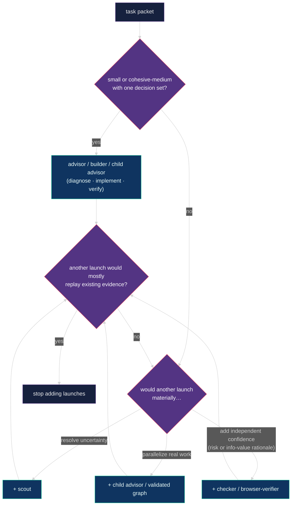

# 🧭 Isolated advisor runtime

The advisor is a technical lead and orchestrator with agency to plan, implement,
verify, and delegate as useful—not an obligation to do everything itself. It
coordinates helper sessions through per-repository state under
`~/.advisor/<repo-key>/`, resolved from the git common directory so all
worktrees of one repository share one root and no repository carries personal
runtime files. `advisor_session_init` reports the resolved root;
`ADVISOR_STATE_DIR` overrides it for tests.
The canonical event translation for this runtime is specified by the
[Pi host binding](advisor-protocol.md#pi-host-binding). Claude Code's standalone
one-maker hook adapter, installation, capability verdicts, and foreground-only
boundary are specified by the
[Claude Code host binding](advisor-protocol.md#claude-code-host-binding).
Codex CLI's hooks-only one-maker adapter, installation, native SubagentStop
delivery boundary, and capability verdicts are specified by the
[Codex host binding](advisor-protocol.md#codex-host-binding).
Protocol step 6 adds manifest-backed graph correlation to every host; Pi is the
reference implementation for wave completion, BLOCKED reply, cancellation, and
node resume. Pi cancellation receipt is a silent shared-bus observation:
`parent.awakened` records durable parent-host receipt and does not imply that a
model response started; pi-detach's killed state ends supervision, not the
native agent process.

## 📏 Runtime rules

1. Launch every separate advisor with `advisor_launch`; it creates a new Herdr tab with `--no-focus`, never a pane split. A manually opened advisor may still invoke `/advisor` in its own fresh tab.
2. `advisor_session_init` creates or claims one isolated workstream, persists one worker mode (`pi` or `native`), trims the session's active tool set, and returns the workstream hot section. The root advisor remains Pi in both modes.
3. The advisor session extension injects the doctrine core (`skills/advisor/doctrine.md`) and a compact rendering of the live intelligence guide into the system prompt on every turn, and re-sends the workstream hot section after every compaction. The advisor reuses the injected doctrine and guide; other skill and contract reads follow the decision-driven policy under Roles and intelligence, and situational references under `skills/advisor/references/` are read only when needed.
4. Each live root advisor must use a different workstream. A child owns a bounded outcome under its parent instead.
5. Within advisor state, an advisor writes only its own session record, its owned workstream record, new immutable events, and unique run output. Product edits follow the assigned checkout boundary, not this state-only restriction.
6. Treat legacy in-repo `.advisor/` directories as read-only history.
7. Transfer ownership with an immutable handoff event.
8. Use Intercom for short conclusions and paths, not transcripts or raw logs.
9. Launch delegated LLM work only through `bg_agent` — usually a configured semantic role, or freeform with no role when the task fits none. Workers remain panes in the owning advisor tab; use `bg_run` for shell commands. Pi mode runs selected identities through Pi. Native mode maps OpenAI identities to Codex CLI and Anthropic identities to Claude Code. Freeform workers always run through Pi. A launch whose prompt still contains an unexpanded paste placeholder is rejected.
10. Every role launch needs concrete acceptance criteria (enumerated falsifiable claims, or a single anchor for trivial nodes) and a bounded result file. The quick packet is the default: goal, write surface, criteria phrased as failure probes, evidence linked by path, one risk-tier line, and stop conditions, in ten to twenty lines. A packet may freeze criteria, safety boundaries, the write surface, and locked decisions; it may never freeze tool versions the repository does not pin, directory modes, hash manifests outside a release gate, or literal command order, and never declares every severity terminal. Makers explore freely and deliver narrowly: they may propose criteria and report adjacent defects, and the advisor accepts proposals through a recorded packet revision.
11. Use the graph planner as a structural validator/linter and coordination aid before three or more nodes or mixed parallel and dependent work, but create a graph only for real independent ownership or dependency boundaries.
12. One writer owns a checkout at a time, including parent and child advisors alongside their helpers. Settle or stop a writing worker before reclaiming its surface. Parallel makers require explicit approval and separate worktrees; independent review uses a frozen revision.
13. Pane labels use `advisor · <purpose>` for advisor roots and `role · <purpose>` for workers, without run-id suffixes. Successful worker panes close automatically; blocked or unknown panes stay visible.
14. Keep a builder alive for a planned bounded repair and a checker alive for the delta review of its own findings. Makers prove criteria and inspect their own diff; an extra fresh-context helper requires a named distinct benefit, not just a Standard/High label. High requires a designated independent checker, without an automatic maker-owned reviewer first. Every checker starts fresh, judges against the packet tier's FAIL bar, and repairs every finding it can inside the reviewed surface in any round, including repair rounds. Auto-fixable mechanical findings (formatter output, lint autofix, generated-file drift, result formatting) are repaired inline by whoever finds them and never bind a verdict; a formatter or lint pass is never an acceptance criterion on its own.
15. Keep global advisor routines paused because open Pi processes share routine state.

## Blocked signals

Every blocking Pi UI prompt, including the question tool and select or confirm
dialogs, marks its Herdr pane blocked through the bridge extension. When a
worker's `result.md` Status starts with `BLOCKED`, the pane is marked blocked as
the turn ends, so the parent `bg_agent` settles it as blocked and the request
sound fires. Pi-detach discovers Pi worker result artifacts through the
`advisor-worker` session entry declared by the profile's `resultDiscovery`
field.

Blocked means exactly one of four things: a missing product decision, a
permission, a credential, or an external action only the user can perform.
Everything else between a worker and its criteria is an obstacle: a tool or
runtime version, a wrong-architecture binary, a missing optional dependency, a
pre-existing failure on an unchanged file, a misnamed skill, a launcher-created
placeholder file. Workers resolve obstacles locally with the least invasive
means, keep working, and record them under a `Deviations` heading in
`result.md`; the advisor reviews deviations after settlement. A safety boundary
the packet names is not an obstacle.

## 🪜 Adaptive topology

Three routes exist: direct work, a single maker, and a graph. For small and
cohesive-medium work with one decision set, presume **one empowered maker** —
the advisor itself, a builder, or a child advisor — from a short packet, and let it
feel like launching one ordinary agent: no planner, no graph, no checker
unless the tier or the user asks for one. Choose direct, delegated, or hybrid
execution by context, decision load, specialization, evidence value, and total
delivery cost. This is a presumption against ceremony, not a target worker
count or an advisor-first bias. Direct implementation is available at every
risk tier with the same maker proof and review duties; self-verification is
never independent review.

The advisor plans by default. Planner output is an advisory recommendation, not
a binding script: inspect its assumptions and adopt, revise, or reject the plan.
A planner is launched only when product or architecture direction has been
invalidated, never after a tooling, environment, harness, or formatting
failure. Preserve accepted criteria and safety boundaries; record a packet
revision when those change, not for every ordinary implementation decision.

Optimize marginal evidence value and critical-path latency: add a child advisor,
graph, checker, browser verifier, or freeform worker whenever it materially
resolves uncertainty, parallelizes real work, or adds useful independent
confidence. Child advisors use the same doctrine: the parent delegates outcomes
and real constraints, not execution strategy. They choose direct work or useful
delegation, not a mandatory role sequence. Their turn cap is advisory while
their helpers are live.
Graphs require genuine ownership or dependency boundaries; dedicated checkers and browser verifiers
require a risk or information-value rationale.
Stop adding launches when another would mostly replay existing evidence.

Makers prove every criterion with task-shaped command evidence and inspect their
own diff. The advisor inspects that evidence and chooses any still-needed
authoritative rerun by risk, oracle strength, and uncertainty; it need not become
a second full-time verifier. Checkers get the full contract/threat context plus
explicit assigned review claims, independently probing the critical or contested
parts rather than replaying every maker command. Explicitly required independent
checks must actually run.

Carry evidence forward only with known tested revision/surface, command/outcome,
producer, and limitations. Bind dirty-worktree evidence to the actual tested
content, not just HEAD. Inspect authenticity and coverage; reject stale,
contradicted, or unverifiable evidence. Rerun what a code, test, dependency, or
environment change invalidates. Delivery assigns the repository's actual merge
or CI gates to an owner and runs them once for the delivered revision and
environment, without unrelated repository-wide sweeps. Ordinary text and paths
suffice; there is no additional evidence form. New evidence that changes success
criteria requires an explicit recorded packet revision, never a hidden stricter
checker contract.

**Lean evidence handoffs.** Treat results and workstream notes as evidence
indexes, not transcript archives. Record each distinct proof once with its
producer, tested revision/surface, exact invocation/outcome, and limitations;
each claim retains its outcome and a precise reference to the proof covering it.
Keep bulk logs, probe source, and full diffs in accessible durable artifacts,
not copied through every report or packet. If separate artifacts are unavailable
or forbidden, retain the necessary proof inline. Failures, missing proof, and
material limitations stay visible in the summary. Read relevant linked proof,
not every supporting log by default; required evidence and critical or contested
claims still need inspection. Missing or inaccessible proof cannot establish a
pass. This adds no citation syntax or length quota.

For example, one maker test run can support two claims when it actually tests
both; each claim cites that same proof. A checker's independent rerun is a
separate execution with its own provenance and outcome, not a second copy of the
maker's proof. A failing claim stays explicit even when its detailed log is linked.

The planner rejects malformed structure, cycles, and invalid `maxParallel` bounds.
Writer coordination is parent/child advisor policy, not a runtime admission gate:
roles, shared checkouts and unresolved prior runs do not create workspace locks.
Real permissions and each worker's lifecycle/replay boundaries still apply.
Checker or browser nodes without
builder ancestors and reducers with low fan-in produce non-blocking warnings
instead: baseline browser investigation, checker audits, and small reduction
shapes can be intentional. Warnings are stored in the immutable graph manifest
and tool details so the advisor can confirm intent without manufacturing
dependencies or relabeling work. Execution waves remain deterministic DAG
output; deciding whether each node has enough information value remains the
advisor's job.

## 🎚️ Risk tiers

Every packet carries one tier, decided by behavioral effect, not filename or
patch size, and recorded with a one-line reason before launch. Standard is
the default when no High surface is named; unknown coupling selects the
higher tier. A repository `AGENTS.md` may refine defaults with a `## Risk tiers`
path map, but cannot downgrade a High-risk effect. Purely mechanical
formatting, test, docs, or metadata repairs can be Low only when runtime
behavior, acceptance oracles, and enforcement semantics remain unchanged.
Changes to an acceptance oracle, security gate, or safety-relevant instruction
take the tier of the boundary they control; the highest applicable tier wins.

| Tier | Covers | Route | Checker FAIL bar |
| --- | --- | --- | --- |
| Low | docs, skills, prompts, specs, config, or test maintenance with unchanged behavior and acceptance/enforcement semantics; bounded repairs with a strong oracle and no higher-tier effect | one maker, deterministic criteria; no added review by default | violated criterion only |
| Standard | product runtime code with coupling or a weak oracle | one maker; fresh review only for material uncertainty or a review trigger | violated criterion or unrepaired High finding |
| High | schema, migration, auth, RLS or security, privacy, money, idempotency, destructive or external effects, concurrency, gate code | one maker and a designated independent checker; no automatic extra maker-owned reviewer; browser verification when visible | violated criterion or unrepaired Medium-or-higher finding |

Finding severity is graded by consequence, separately from tier: High breaks a
security, data, money, auth, or destructive boundary or a risk invariant;
Medium is a bounded correctness defect in the changed surface; Low is
everything else. A violated criterion takes the severity of what it breaks.

## 🔍 Review proportionality

Fresh context is useful when it resolves a named uncertainty, not as a ritual
between maker proof and independent checking. A maker-owned helper remains maker
evidence and cannot replace High's designated independent checker. Extra review
needs a distinct purpose not covered by the planned check. Choose model and
effort from actual review need and the guide, not a fixed offset from the maker.

Checkers are repair-first. A checker repairs every finding it can inside the
reviewed surface, at any severity, unless the fix needs a product decision,
changes schema or migration semantics, or has an external effect. Its verdict
describes the post-repair state. A repaired finding alone does not cause FAIL;
unmet criteria or new defects still bind at the tier's bar. The original
assessment remains independent, but the checker's own patch has
self-verification, not independent review of that patch. The advisor inspects
the rerun evidence and delta, preserves unaffected review evidence, and closes
it when no material independent risk remains. Otherwise assign a scoped read
or probe to a reviewer who did not author the patch. The original maker may
serve when its prior assumptions are not the contested issue; there is no
automatic checker-of-checker or whole-work re-review.

Resume the same checker for a delta review of a maker's repair; use fresh
review when prior reasoning is invalidated or material independent risk
remains. Two serial review rounds per slice is the default budget. At that
budget or a binding user, graph, or runtime cap, stop the loop and reassess;
a budget is not evidence of completion. Deliver only when all acceptance
criteria, required checks, and safety obligations are satisfied, disclosing
only non-blocking residuals. Otherwise report the work as incomplete and
choose a changed approach within remaining authority and limits, or ask the
user with a recommended next step. Further work needs an explicit, authorized
bounded plan; never silently reset a cap by renaming the slice or launching
another planner. User-set limits or requirements need user approval to change.

Review depth follows meaningful failure modes, oracle strength, coupling, and
trust boundaries. Deepen on a concrete gap or contradictory evidence. Stop when
assigned claims and material risks are resolved with current evidence and no
material contradiction remains. More possible tests or a large assertion count
is not an objective; neither elapsed time nor no findings alone proves safety.

Examples, not fixed routes:

- A coupled Standard repair with strong relevant tests and no unresolved material
  uncertainty may finish with maker proof and own-diff inspection, without a helper.
- A High authorization repair uses maker proof plus a designated independent
  checker for the boundary. Do not add a maker-side reviewer for the same purpose.
- A weak acceptance oracle may warrant substantial independent probes; if the
  packet explicitly requires generated reference or mutation checks, run them.
- An integrated child-advisor result reuses current component evidence and verifies
  the integration delta plus required final checks, not every child's work again.
- A checker that finds one Medium race in a reviewed file fixes it, reruns the
  affected criteria, and reports the post-repair state. The advisor can close
  the delta from the proof and patch when no material independent risk remains.
- A checker-authored authorization fix with a weak oracle needs scrutiny from
  someone who did not author the patch, scoped to the unresolved boundary.
- Editing an authorization test's acceptance oracle or a security-policy
  instruction is High when it changes that boundary; a comment-only repair
  with unchanged enforcement can be Low.
- Exhausting two rounds with a failed required check leaves the work incomplete,
  not shippable with a disclaimer; a clean result with only optional notes may ship.

## 🎭 Roles and intelligence

Configured roles are `scout`, `planner`, `reducer`, `builder`, `advisor`,
`checker`, and `browser-verifier`. A child advisor uses the same installed
advisor doctrine and intelligence guide as the root, scoped to one parent
outcome. It may implement directly, use specialists, or delegate further to
child advisors; an optional local graph belongs to its parent outcome. The
runtime supplies validated ancestry and a separate graph namespace, not a new
top-level workstream. It shares the root family's cumulative allowance and
cancellation tree. The delegation flag also grants the builder
at most one optional read-only review helper under its role contract; ordinary
specialist helpers retain the no-further-delegation prohibition.

Workers load their own role skill and contract. Do not preload those or
repository skills merely to launch a worker. Read the relevant skill or
contract section when a concrete planning, review, investigation,
implementation, or recovery decision needs it; you need not be editing code.
Required task and safety instructions still apply. Reuse material already
in context and keep additional reads bounded.

Every role has agency over methods, evidence, and ordinary local choices within
its mandate, including resolving environment and tooling obstacles. Packets
include the broader goal, why the contribution matters, upstream evidence,
downstream consumers, and locked versus suggested decisions. Builders own
in-scope diagnosis, technical choices, tests, and repairs without routine
permission round-trips; scouts, reducers, and browser verifiers retain product
read-only boundaries. Checker repairs stay inside the reviewed surface with
exclusive write ownership. Classify by behavioral effect: acceptance oracles and
security gates are enforcement work even in `tests/` or `evals/`, not harmless
test-only changes. Mechanical fixes preserve behavior and the acceptance
standard; a generated diff is not automatically mechanical.

[`../config/bg-agent-profiles.json`](../config/bg-agent-profiles.json) is fixed
semantic role configuration: the instructed role skill and portable skill path,
anchor requirement, and instructional cycle cap. Cycle caps are advisory
ceilings, never a reason for a child advisor to stop while its helpers are live. It
contains no model or reasoning policy and is never changed by intelligence
switching.

The persisted worker mode is the default for every configured role launch and
is authoritative over conflicting per-launch requests. A generic profile-level
`harness` constraint takes precedence when a role depends on one runtime. It
changes transport, not roles or intelligence policy:

| Mode | Transport |
| --- | --- |
| `pi` | `bg_agent` starts Pi and forwards the selected provider/model/reasoning. |
| `native` | `openai-codex`/`openai` route to Codex CLI; `claude-bridge`/`anthropic` route to Claude Code. Native workers receive an automatically generated durable result path under the advisor state root, reserved before launch as an empty file with the launcher's default modes. Settlement stalls only when that artifact is missing or blank. Missing, empty, or differently formatted expected sections are advisory notes surfaced to the parent and do not prevent settlement. |

The advisor profile is constrained to `harness: "pi"`, including in a session
whose specialists use native Codex/Claude. The inherited specialist choice is
independent of that transport constraint. A runtime-issued v2 grant binds each
child to a stable parent outcome; a role label or copied graph cannot grant
scope. Child graphs use that child's state root, with `parentOutcome` derived
by the extension and checked by the runtime. A graphless parent/child is valid.

Launch/reply/task reservations share one persistent family allowance and retain
per-outcome repair history. Descendant cancellation is downward; observed
settlement composes upward before parent result capture. Acknowledgement remains
a separate shutdown condition. An old PASS, dead service or uncertain child
never becomes current proof. Historical foreman skill paths are compatibility
links, not a separate management role; old v1/unmetered scopes need explicit
reissue for new execution. There is no automatic migration or crash adoption.

Every shipped intelligence profile remains usable in either mode, but a
specific recommendation is native-routable only when its provider maps to Codex
or Claude. Cursor/Grok has no provider-native route in this two-harness mode.
The advisor chooses a task-fit OpenAI/Anthropic recommendation from the same
active guide or reports the mismatch rather than silently changing the session
mode.

Named guides in
[`../config/intelligence-profiles/`](../config/intelligence-profiles/) are the
advisor's source of model character and ordered role recommendations. Install
copies them to `~/.pi/agent/intelligence-profiles/` and materializes the active
guide as `~/.pi/agent/advisor-intelligence.json`, which the session extension
renders into the advisor's system prompt on every turn. Switch mid-session with
`node ~/.pi/agent/bin/intelligence-profile.mjs <name>`; the switch takes effect
on the next turn. The default is `codex-max`.

Recommendations are advisory, not exhaustive or enforceable. The advisor
chooses the best model and reasoning for the task from or outside the guide,
using fit, capability, cost, quota, and availability as judgment inputs. An
outside-guide choice needs only a concise rationale when material and never
permission merely for being unlisted. Worker launch and task execution do not
reject an outside-guide or changed identity; manifests retain launch and
current identity for audit. Quota is not polled — you pick the guide.

Deep dive (topology, spend, pick tree, recommendations, `/advisor` vs
switcher): [`intelligence-profiles.md`](intelligence-profiles.md).

## 🧠 Session context

The advisor's standing context is small by construction:

- the doctrine core, about six thousand tokens, injected into the system
  prompt for the whole session;
- the active intelligence guide, rendered compactly and refreshed each turn;
- the workstream hot section, everything above `## Log` in the workstream
  file within about sixty lines, returned by `advisor_session_init` and re-sent
  after every compaction;
- a trimmed tool set: routine, goal, and most memory tools are inactive in
  advisor sessions because the workstream file is the durable memory.

References under `skills/advisor/references/` (graphs, model routing,
evidence, transport and settlement) are read only when their situation arises.
Workers load their own role skill from the packet path. Advisor skill reads
follow the decision-driven policy under Roles and intelligence: no launch-time
preload, but inspect the relevant section when a concrete decision needs it,
even when not editing.

## 🚦 Start

From any Pi session running inside Herdr, call `advisor_launch` with the target
`cwd` and, when known, a concise `workstream`, `purpose`, and `workerHarness`.
The tool creates an unfocused Herdr tab, labels its root pane
`advisor · <purpose>`, starts Pi there, and sends `/skill:advisor-pi` or
`/skill:advisor-native` when the mode is explicit. If it is omitted, the new Pi
advisor uses `/skill:advisor` and asks in the UI. The new advisor still calls
`advisor_session_init` as its first action.

For a tab opened manually, invoke `/advisor` or `/skill:advisor` to choose the
mode interactively, or invoke `/skill:advisor-pi` / `/skill:advisor-native` to
choose directly. Enter a short workstream name if Pi asks. Do not use a pane
split for a separate advisor. No advisor shell launcher is required.
