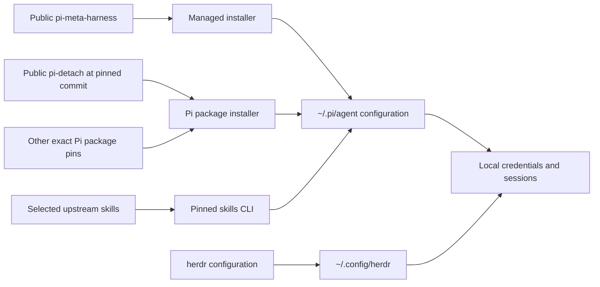

# Architecture

The harness separates portable source, installed configuration, and local runtime state.

`X` is not stored in Git. It represents machine-local state that the user creates after installation.

## Ownership boundaries

The harness owns:

- first-party advisor extensions and skills;
- fixed `bg_agent` role guardrails;
- named advisor intelligence guides and the separate live guide they materialize
  (see [`intelligence-profiles.md`](intelligence-profiles.md));
- safe Pi and MCP overlays;
- exact Pi package versions or full Git commits;
- Herdr presentation and notification configuration;
- install, restore, test, and doctor logic.

Pi owns package installation and provider login. Herdr owns and regenerates its Pi integration. Upstream skill repositories own third-party skill source.

## Install behavior

The installer copies first-party files, deep-merges safe MCP settings, and merges package settings by package identity. A new exact pin replaces an old version of the same package without deleting unrelated user packages.

`bg-agent-profiles.json` is installed as fixed, generic role transport
configuration. Named guides are refreshed under `intelligence-profiles/`, while
the existing `ACTIVE` selection is preserved and rematerialized as
`advisor-intelligence.json`. Switching a guide never rewrites role transport.

Before each mutation, it creates a scoped backup. It does not reload Pi, migrate an active session, or copy authentication.

`pi-detach` is not vendored. The settings overlay points to its public repository at one full reviewed commit. That transport accepts legacy intelligence fields but ignores them; this harness supplies standalone role-only configuration.

## Herdr session topology

`advisor_launch` is the canonical boundary for a separate advisor: it creates an unfocused Herdr tab at the requested cwd, labels the root pane `advisor · <purpose>`, starts Pi, and submits the advisor bootstrap. It never falls back to splitting the caller's tab. `advisor_session_init` also restores that root-pane label from workstream words.

Configured `bg_agent` workers follow the opposite rule: they stay visible as panes in their owning advisor tab. Their labels are concise `role · <purpose>` values; run IDs remain in agent identities and notifications rather than pane titles.

## Reproducibility boundary

Pi packages and first-party files are exact. Each third-party skill group records a full source commit and Git tree. The installer fetches that commit directly, verifies both IDs, copies the selected skills, and then verifies each installed folder against its SHA-256 lock.

Host package managers remain an update boundary: Homebrew resolves current compatible Herdr and Engram builds, while the live doctor enforces the supported minimums. Pi and agent-browser use exact versions.

Unit tests enforce full 40-hex Git package pins without network access. Run
`node scripts/meta-harness.mjs verify-git-pins` as an explicit publication or
cutover preflight to fetch each exact commit with a per-pin timeout. Keeping the
network check opt-in preserves deterministic offline tests.
