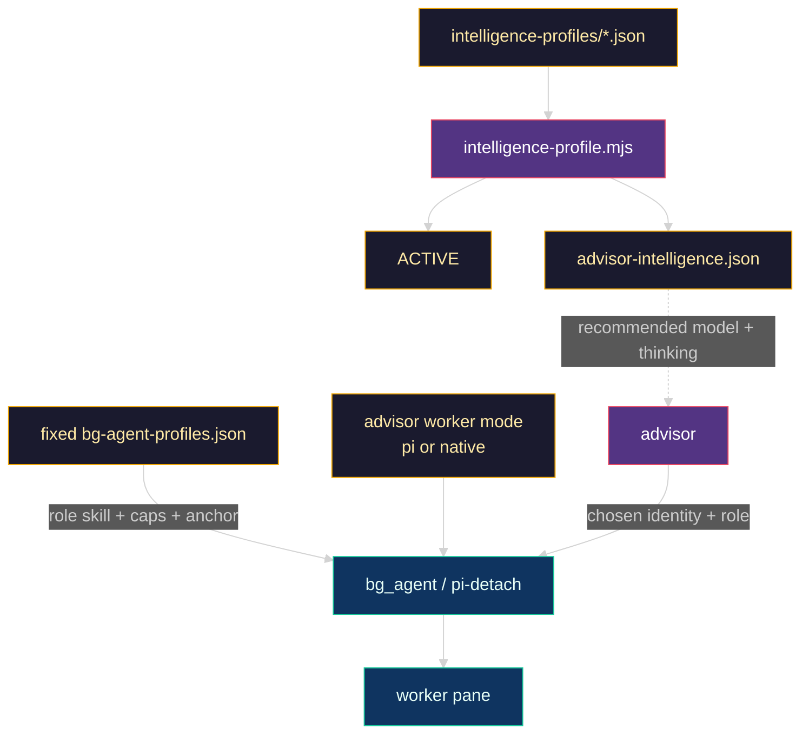
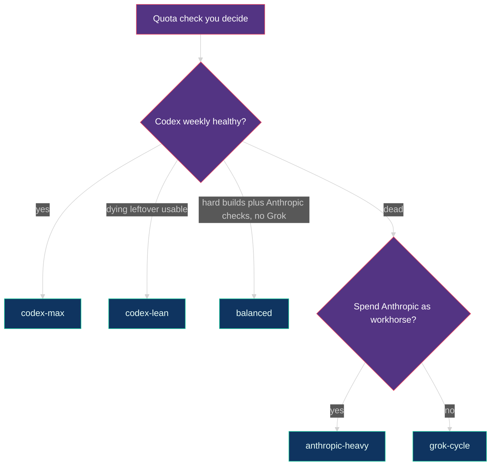

# 🧠 Advisor intelligence profiles — deep dive

Named JSON profiles guide which models and reasoning levels an advisor should
prefer for each worker role. They do **not** configure `pi-detach`, constrain
worker identity, or poll Codex weekly, Anthropic 5-hour, or Cursor spend.

The split is deliberate:

- `bg-agent-profiles.json` is fixed semantic role configuration: instructed
  skill and portable skill path, anchors, and instructional cycle caps.
- `advisor-intelligence.json` is the live advisor-owned guide: model character,
  default reasoning guidance, and ordered role recommendations.

Recommendations are advisory, not exhaustive or enforceable. An advisor chooses
the best model and reasoning for the task from or outside the guide, balancing
fit, capability, cost, quota, and availability. An outside-guide choice needs a
concise rationale only when material and never permission merely for being
unlisted. Workers accept outside-guide and changed identities while recording
launch/current identity for audit.

Shipped default: **`codex-max`**. Reinstall refreshes fixed roles and all named
guides but preserves the name in `intelligence-profiles/ACTIVE`.

## ⚡ Daily commands

`/advisor` is a skill invoke, not a CLI with profile flags:

```text
/advisor

my task here
```

Pick the guide before workers launch:

```bash
node "$HOME/.pi/agent/bin/intelligence-profile.mjs" --list
node "$HOME/.pi/agent/bin/intelligence-profile.mjs" grok-cycle
```

Names: `codex-max` | `codex-lean` | `anthropic-heavy` | `balanced` | `grok-cycle`.

Choose worker transport separately. `/advisor` asks once and persists the answer;
`/skill:advisor-pi` and `/skill:advisor-native` select it directly. The active
guide still chooses model and reasoning in either mode. Pi mode forwards that
identity to Pi. Native mode maps OpenAI providers to Codex CLI and Anthropic
providers to Claude Code while retaining the same four semantic roles and skills.
Cursor/Grok recommendations are not directly routable in native mode, so the
advisor uses a task-fit OpenAI/Anthropic alternative from the same guide or
reports the mismatch.

The switcher validates the fixed role names and all guide references, copies the
selected named guide to `~/.pi/agent/advisor-intelligence.json`, writes `ACTIVE`,
and reports each role's preferred choice. It never writes
`bg-agent-profiles.json`. Already-running workers and this Pi session's `/model`
remain unchanged.

## 📐 Guide schema

Each named file uses this shape:

```json
{
  "name": "codex-max",
  "models": {
    "provider/model": {
      "character": "Advisory task-fit and capacity guidance.",
      "defaultThinking": "high"
    }
  },
  "recommendations": {
    "builder": [
      {
        "model": "provider/model",
        "thinking": "high",
        "fit": "Preferred implementation choice in this profile."
      }
    ]
  }
}
```

Recommendation order is preference order. Validation catches malformed
reasoning names, missing models, missing configured roles, and misspelled role
references. This validates the guide itself; it does not turn the guide into a
runtime allowlist.

## 🔀 Decision-bearing builders and locked executors

Recommendation order applies **among choices that fit the task**; it is not a
rule to spend the first model on every node. Builder routing starts with decision
load and risk:

- use the profile's strong builder when diagnosis, architecture, or a material
  product/schema/migration/auth/security/destructive-operation decision remains;
- use the profile's cheap executor when a concise execution packet has fixed the
  approach, bounded the surface, named existing patterns and non-goals, and
  provided deterministic anchors;
- if the cheap executor discovers a missing material decision or contradictory
  evidence, it stops and escalates rather than inventing a route.

The shipped locked-packet executors are:

| Profile | Cheap executor |
| --- | --- |
| `codex-max` | Sol high |
| `codex-lean` | Sol medium |
| `balanced` | Sol high |
| `anthropic-heavy` | Sol high while Codex capacity remains |
| `grok-cycle` | Sonnet medium |

This is advisory task-fit guidance, not a model allowlist or a deterministic
small-file rule. A cheap maker does not automatically earn another checker;
review tier follows the product risk and deterministic anchors remain the
backstop.

## 🧩 Topology



## 🌳 Which guide to pick



- **healthy Codex** → `codex-max`
- **Codex leftover** → `codex-lean`
- **Codex dead and Anthropic should implement** → `anthropic-heavy`
- **Codex hard builds plus Anthropic default builds/checks, no Grok** → `balanced`
- **Codex dead and Grok owns maker/review** → `grok-cycle`

The shipped guides recommend Cursor only as `cursor/grok-4.6`; that is guidance,
not transport enforcement.

## 🃏 Profile cards

The tables summarize preferred order. The JSON `character` and `fit` fields hold
the detailed task and capacity guidance. The shipped roles are advisor, builder,
checker, and browser-verifier. Advisors own planning and synthesis; builders and
checkers investigate, plan, implement or repair, and verify within their assignment.
Browser-verifier is a focused evidence worker: prefer an economical model and small
task-shaped context for explicit flows and before/after captures, escalating when
ambiguity or risk needs it. A different model is not required for independent review;
a nonauthor assessment is.

### `codex-max` — healthy Codex

| Role | Ordered recommendations |
| --- | --- |
| advisor | Astra xhigh (root session and child advisor) |
| builder | Astra xhigh (all decision-bearing work), Sol high (locked packet), Grok high |
| checker | Sol xhigh, Sol high |
| browser-verifier | Luna max |

Astra owns advisor planning and synthesis and primary decision-bearing builds at
xhigh, including substantial implementation and every kind of UX work.
Greenfield and existing UX both load `frontend-design`. Sol xhigh handles
fresh-context review, including adversarial checks; Sol high handles routine
checks and locked execution packets. Luna max handles focused browser evidence.
Grok stays as the capacity alternate for bounded backend work. This profile
recommends no Anthropic model. Lower total task cost is a hypothesis, not a measured
guarantee. Changing the guide does not change an already-running advisor's reasoning
level or a worker's launch identity.

### `codex-lean` — Codex-only, effort-lean

| Role | Ordered recommendations |
| --- | --- |
| advisor | Astra xhigh (root session and child advisor) |
| builder | Sol medium; Sol max (ambiguous or wide breadth) |
| checker | Sol medium |
| browser-verifier | Luna max |

Astra runs at xhigh wherever it is used, including advisor planning and synthesis.
Sol medium is the regular builder, locked-packet executor, and checker; Sol max
handles materially ambiguous or wide-breadth implementation. Luna max handles
focused browser evidence. Every mapped model is an OpenAI Codex model; the guide
remains advisory rather than a runtime allowlist.

### `anthropic-heavy` — spend the 5-hour window deliberately

| Role | Ordered recommendations |
| --- | --- |
| advisor | Fable medium (root session); Sonnet high (child) |
| builder | Sonnet high, Opus medium, Grok high, Sol high (locked packet) |
| checker | Sonnet high, Opus medium, Sol high, Grok high |
| browser-verifier | Sol high, Grok high |

Sonnet is the decision-bearing implementation and review workhorse, Opus is the
greenfield UX or extreme-risk option, Sol high uses remaining Codex for locked
execution packets and procedural work, and Grok remains the capacity fallback,
including for the root advisor when Fable reaches capacity.

### `balanced` — Codex builds hard, Anthropic builds/checks the rest

| Role | Ordered recommendations |
| --- | --- |
| advisor | Fable medium (root session); Sonnet high (child) |
| builder | Sonnet high, Astra high (hard backend), Opus medium, Sol high (locked packet) |
| checker | Sonnet high, Opus medium, Sol xhigh |
| browser-verifier | Sol high, Sonnet high |

Sonnet is the default decision-bearing maker and checker; Astra high takes hard
backend work and root advisor capacity fallback. Opus takes greenfield UX; Sol high
executes locked packets and procedural work and Sol xhigh is the Codex review
alternate. Grok is absent from the recommendations but is not blocked at runtime.

### `grok-cycle` — no Codex recommendations

| Role | Ordered recommendations |
| --- | --- |
| advisor | Fable medium (root session); Grok high, Sonnet medium (child) |
| builder | Grok high, Sonnet medium (locked packet) |
| checker | Grok high, Sonnet medium |
| browser-verifier | Sonnet medium, Grok high |

Grok is preferred for decision-bearing implementation and review, and is the root
advisor fallback when Fable reaches capacity. Sonnet medium handles locked execution
packets, procedural work, and native-harness assignments without a Cursor route.
When risk warrants independent review of a Grok build, use a fresh nonauthor
assessment and preserve deterministic evidence.

## 📁 Files on disk

| Path | Role |
| --- | --- |
| `config/bg-agent-profiles.json` | Fixed semantic role configuration and portable skill paths |
| `config/intelligence-profiles/<name>.json` | Named advisor guidance in this repository |
| `scripts/intelligence-profile.mjs` | Guide validator, status command, and switcher |
| `~/.pi/agent/bg-agent-profiles.json` | Installed fixed role configuration |
| `~/.pi/agent/intelligence-profiles/` | Installed named guides plus `ACTIVE` |
| `~/.pi/agent/advisor-intelligence.json` | Live copy of the selected guide |

Doctor verifies fixed role shape, validates every named guide against configured
role names, and requires `ACTIVE` to be present, nonempty, known, and
byte-equivalent to the live guide. Missing pointers, stale pointer/live pairs,
and interrupted switches fail precisely. Reinstall performs the same preflight
before creating a backup or replacing files, so it never silently chooses one
side of a mismatch.

Repair selection drift explicitly with:

```bash
node "$HOME/.pi/agent/bin/intelligence-profile.mjs" <intended-name>
node scripts/meta-harness.mjs doctor --live
```

A clean install selects `codex-max`; a legacy mixed configuration may migrate a
known `ACTIVE` name when no split live guide exists. Doctor does not inspect or
reject an advisor's runtime model choice.

Related: [`advisor-runtime.md`](advisor-runtime.md),
[`architecture.md`](architecture.md), and
[`skills/switch-intelligence-profile/SKILL.md`](../skills/switch-intelligence-profile/SKILL.md).
