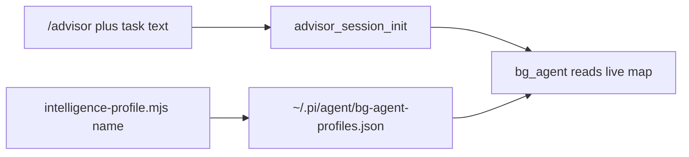
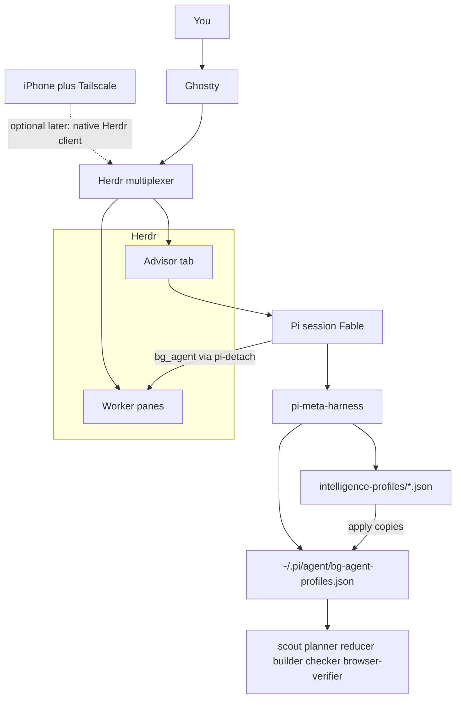
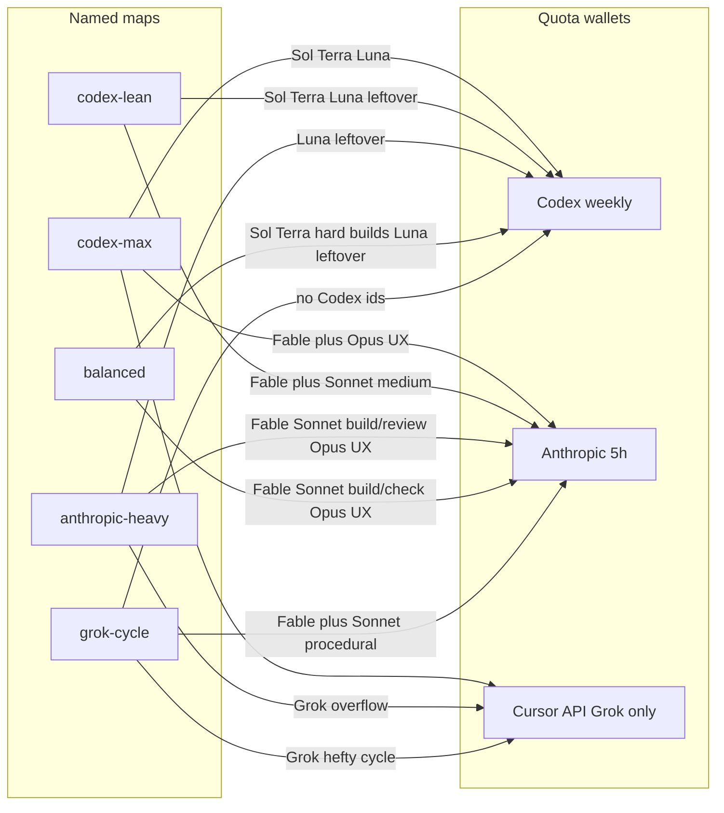
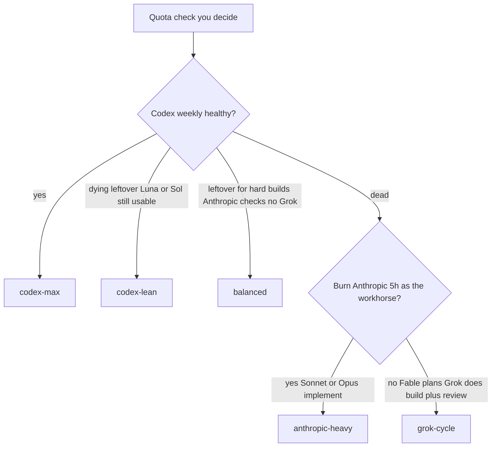
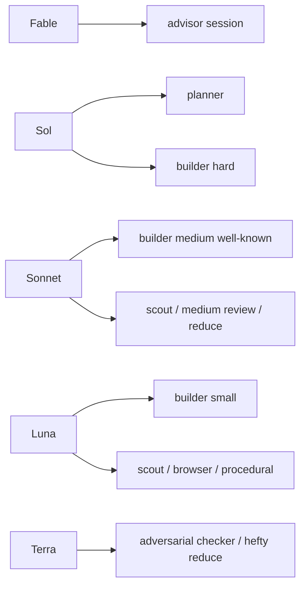

# Intelligence profiles — deep dive

Named JSON maps pick which models an advisor may launch for each worker role.
They do **not** poll Codex weekly, Anthropic 5-hour, or Cursor spend. You choose
the map. The switcher copies that file onto the live config. The next `bg_agent`
launch reads it.

JSON in [`config/intelligence-profiles/`](../config/intelligence-profiles/) is
the source of truth. Character notes in the active file are binding. Role skill
text must not hard-code a different model. Cursor may only appear as
`cursor/grok-4.6`.

Shipped default: **`codex-max`**. Reinstall keeps whatever name is in
`intelligence-profiles/ACTIVE`, so an existing machine is not stomped back to
default.

## Daily commands

Start a new advisor in a fresh Pi tab inside Herdr (cwd already the repo).
`/advisor` is a skill invoke, not a CLI with flags. There is no
`/advisor "task" --profile lean`.

```text
/advisor

my task here
```

Same skill: `/skill:advisor`. Put the task in that message or the next one. If
the workstream slug is not obvious, Pi asks. Do not invent a generic slug such
as `engineering`.

Pick the map **before** workers launch. It is machine-global, not per-session
argv:

```bash
node "$HOME/.pi/agent/bin/intelligence-profile.mjs" --list
node "$HOME/.pi/agent/bin/intelligence-profile.mjs" grok-cycle
```

Names: `codex-max` | `codex-lean` | `anthropic-heavy` | `balanced` | `grok-cycle`.

Mid-session, say `switch to lean` in the advisor chat, or run the same node
command. Already-running workers keep their launch model. The advisor pane does
not auto `/model`. If Fable is at Anthropic capacity, switch the **session**
yourself to the fallback named in Fable's character note.



## What is dynamic vs not

Dynamic after a switch:

- the next `bg_agent` re-reads `bg-agent-profiles.json`
- in-map **capacity fallbacks** (Fable → Sol or Grok, Opus → Grok) fire only
  if a launch actually fails, or the advisor already knows capacity is gone

Not automatic:

- flipping `codex-max` → `codex-lean` / `grok-cycle` because weekly is at 13%
- flipping back when weekly resets
- changing this Pi session's `/model`

The pick tree below is a **you-decide** rule. `intelligence-profile.mjs` only
copies JSON and writes `ACTIVE`. Zero quota APIs.

## Topology

Ghostty hosts Herdr. Advisors live in their own tabs. Workers stay panes in the
owning advisor tab via `pi-detach` `bg_agent`. The live map is one file on the
machine.



## Quotas the maps protect

Three wallets. Cursor is Grok only — never Terra/Luna/Sol via Cursor.



## Which map to pick

Split the questions. Do not hang `grok-cycle` off a yes/no Anthropic diamond.



Pick rule:

- **healthy Codex** → `codex-max` (Sol / Terra / Luna)
- **Codex leftover, still spend Codex on plan/hard/review** → `codex-lean`
  (Sol plans + hard builds; Sonnet medium; Luna small; Terra adversarial).
  Grok-as-main is **not** this map.
- **Codex dead + Anthropic should implement** → `anthropic-heavy`
- **Split wallets, no Grok: Codex builds hard, Anthropic builds the rest and
  checks** → `balanced` (Fable plans; Sonnet default builder + adversarial
  review; Sol/Terra hard backend; Opus greenfield UX; Luna procedural)
- **Codex dead + Fable stays the brain, Grok does build+review** → `grok-cycle`

## Profile cards

Same six roles everywhere: `scout` `planner` `reducer` `builder` `checker`
`browser-verifier`. First listed `allowedModels` entry is the usual default;
character notes still bind.

### `codex-max` — shipped default

When Codex weekly is healthy.

| Slot | Model |
| --- | --- |
| Advisor / planner | Fable; Sol high if Anthropic capacity is gone |
| Build | Sol; Opus greenfield UX; Grok research / existing-UX |
| Review / reduce | Terra xhigh adversarial; Sol medium standard checking; Terra reduce |
| Procedural (scout / chores / browser) | Luna |

Role allowlists:

| Role | Allowed models |
| --- | --- |
| planner | Fable, Sol |
| builder | Sol, Opus, Terra, Luna, Grok |
| checker | Terra, Sol, Luna |
| reducer | Terra |
| scout | Luna, Terra, Grok |
| browser-verifier | Luna, Terra |

Reasoning is role-scoped: planner permits Sol high, builder permits Sol
high/xhigh/max, and **only checker permits Sol medium**. Checker keeps Terra
xhigh for adversarial review and Luna max for procedural checks.

### `codex-lean` — leftover Codex, Grok lives on `grok-cycle`

When weekly is dying but Sol / Terra / Luna are still usable. No Grok. No Opus.
Fable is **advisor-only**; planner is Sol.



| Role | Allowed models | Pick |
| --- | --- | --- |
| Advisor session | Fable | capacity → Sol, not Grok |
| planner | Sol only | Fable is not a planner here |
| builder | Sol, Sonnet, Luna | hard / medium well-known / easy-small |
| checker | Terra, Sonnet, Luna | adversarial / medium / procedural |
| reducer | Terra, Sonnet, Luna | hefty / medium / cheap |
| scout + browser | Luna, Sonnet | Luna default |

### `anthropic-heavy` — burn the 5-hour window on purpose

When Codex is dead (or ignored) and Anthropic should implement.

| Slot | Model |
| --- | --- |
| Advisor / planner | Fable; Grok if Fable is at capacity |
| Build | Sonnet; Opus greenfield UX |
| Adversarial review | Sonnet; Opus if high-risk |
| Procedural | Luna leftover, else Grok |

Role allowlists:

| Role | Allowed models |
| --- | --- |
| planner | Fable, Grok |
| builder | Sonnet, Opus, Grok, Luna |
| checker | Sonnet, Opus, Luna, Grok |
| reducer | Sonnet, Opus |
| scout | Luna, Grok, Sonnet |
| browser-verifier | Luna, Grok |

### `balanced` — Codex builds hard, Anthropic builds the rest and checks

No Grok anywhere. Fable plans like `codex-max`; the Anthropic side takes the
default build plus all checking (the slot Terra holds in the Codex maps);
Sol and Terra stay pure hard-build workhorses.

| Slot | Model |
| --- | --- |
| Advisor / planner | Fable; Sol if Anthropic capacity is gone |
| Build | Sonnet default; Sol or Terra hard backend; Opus greenfield UX; Luna small |
| Adversarial review / reduce | Sonnet; Opus when Sonnet was the maker or risk is extreme |
| Procedural (scout / chores / browser) | Luna |

Role allowlists:

| Role | Allowed models |
| --- | --- |
| planner | Fable, Sol |
| builder | Sonnet, Sol, Terra, Opus, Luna |
| checker | Sonnet, Opus, Luna |
| reducer | Sonnet, Opus, Luna |
| scout | Luna, Sonnet |
| browser-verifier | Luna, Sonnet |

### `grok-cycle` — no Codex ids

When Codex is gone and Grok owns the hefty maker+review loop. A Grok review of
a Grok build is expected; deterministic anchors are the independence backstop,
not a second model.

| Slot | Model |
| --- | --- |
| Advisor / planner | Fable; Grok if Anthropic capacity is gone |
| Build | Grok |
| Adversarial review / reduce | Grok |
| Procedural (scout / chores / browser) | Sonnet |

Role allowlists:

| Role | Allowed models |
| --- | --- |
| planner | Fable, Grok |
| builder | Grok, Sonnet |
| checker | Grok, Sonnet |
| reducer | Grok |
| scout + browser | Sonnet, Grok |

## Files on disk

| Path | Role |
| --- | --- |
| `config/intelligence-profiles/<name>.json` | Named maps in this repo |
| `config/bg-agent-profiles.json` | Checked copy of `codex-max` for readers and doctor |
| `scripts/intelligence-profile.mjs` | Switcher; `DEFAULT_PROFILE` is `codex-max` |
| `~/.pi/agent/intelligence-profiles/` | Installed named maps plus `ACTIVE` |
| `~/.pi/agent/bg-agent-profiles.json` | Live map `bg_agent` reads |

Do not edit the live map by hand. Doctor requires the live file to match a
named profile. Cursor models other than `cursor/grok-4.6` are rejected.

Related: [`advisor-runtime.md`](advisor-runtime.md) (workstream rules),
[`architecture.md`](architecture.md) (install topology),
[`skills/switch-intelligence-profile/SKILL.md`](../skills/switch-intelligence-profile/SKILL.md)
(advisor chat hook).
