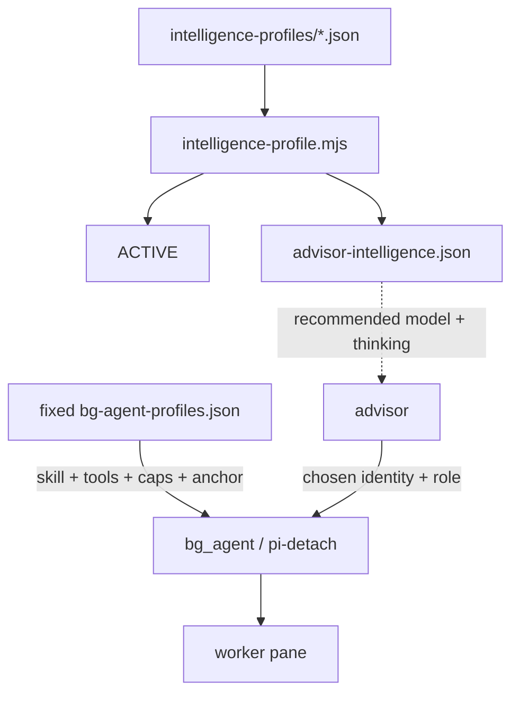
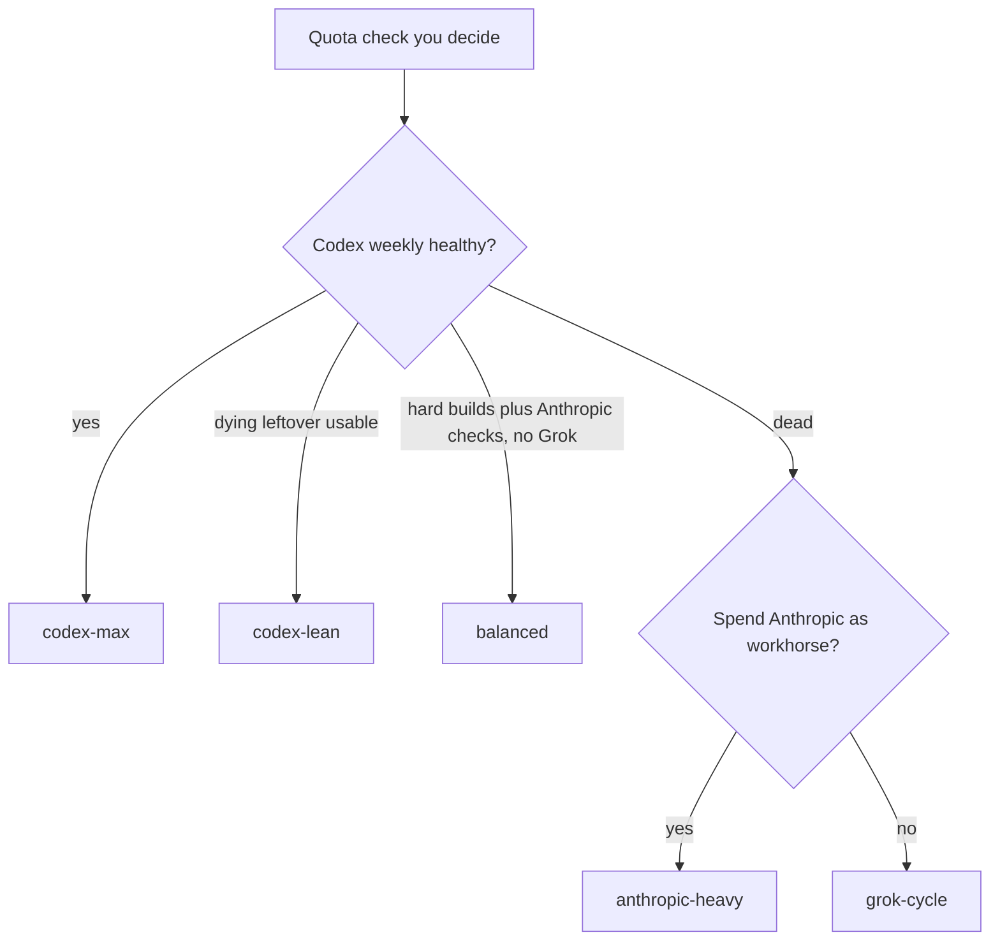

# Advisor intelligence profiles — deep dive

Named JSON profiles guide which models and reasoning levels an advisor should
prefer for each worker role. They do **not** configure `pi-detach`, constrain
worker identity, or poll Codex weekly, Anthropic 5-hour, or Cursor spend.

The split is deliberate:

- `bg-agent-profiles.json` is fixed role transport: agent, forced skill, tools,
  CLI flags, anchors, and cycle caps.
- `advisor-intelligence.json` is the live advisor-owned guide: model character,
  default reasoning guidance, and ordered role recommendations.

Recommendations are advisory, not exhaustive or enforceable. An advisor may
choose a model or reasoning level absent from the guide when the task warrants
it, and should record a concise rationale. Workers accept outside-guide and
changed identities while recording launch/current identity for audit.

Shipped default: **`codex-max`**. Reinstall refreshes fixed roles and all named
guides but preserves the name in `intelligence-profiles/ACTIVE`.

## Daily commands

`/advisor` is a skill invoke, not a CLI with profile flags:

```text
/advisor

my task here
```

Pick the guide before workers launch:

```bash
node "$HOME/.pi/agent/bin/intelligence-profile.mjs" --list
node "$HOME/.pi/agent/bin/intelligence-profile.mjs" grok-cycle
```

Names: `codex-max` | `codex-lean` | `anthropic-heavy` | `balanced` | `grok-cycle`.

The switcher validates the fixed role names and all guide references, copies the
selected named guide to `~/.pi/agent/advisor-intelligence.json`, writes `ACTIVE`,
and reports each role's preferred choice. It never writes
`bg-agent-profiles.json`. Already-running workers and this Pi session's `/model`
remain unchanged.

## Guide schema

Each named file uses this shape:

```json
{
  "name": "codex-max",
  "models": {
    "provider/model": {
      "character": "Advisory task-fit and capacity guidance.",
      "defaultThinking": "high"
    }
  },
  "recommendations": {
    "builder": [
      {
        "model": "provider/model",
        "thinking": "high",
        "fit": "Preferred implementation choice in this profile."
      }
    ]
  }
}
```

Recommendation order is preference order. Validation catches malformed
reasoning names, missing models, missing configured roles, and misspelled role
references. This validates the guide itself; it does not turn the guide into a
runtime allowlist.

## Topology



## Which guide to pick



- **healthy Codex** → `codex-max`
- **Codex leftover** → `codex-lean`
- **Codex dead and Anthropic should implement** → `anthropic-heavy`
- **Codex hard builds plus Anthropic default builds/checks, no Grok** → `balanced`
- **Codex dead and Grok owns maker/review** → `grok-cycle`

The shipped guides recommend Cursor only as `cursor/grok-4.6`; that is guidance,
not transport enforcement.

## Profile cards

The tables summarize preferred order. The JSON `character` and `fit` fields hold
the detailed task and capacity guidance.

### `codex-max` — healthy Codex

| Role | Ordered recommendations |
| --- | --- |
| planner | Fable high, Sol high |
| builder | Sol high, Opus medium, Terra xhigh, Luna max, Grok high |
| checker | Terra xhigh, Sol medium, Luna max |
| reducer | Terra xhigh |
| scout | Luna max, Terra xhigh, Grok high |
| browser-verifier | Luna max, Terra xhigh |

Sol is the difficult implementation workhorse, Terra is the adversarial review
and reduction tier, Luna handles procedural work, Opus covers greenfield UX, and
Grok covers bounded research/mixed-stack/existing-UX work. Fable remains the
advisor/planner default, with Sol as capacity fallback.

### `codex-lean` — spend the Codex remainder carefully

| Role | Ordered recommendations |
| --- | --- |
| planner | Sol high |
| builder | Sol high, Sonnet high, Luna max |
| checker | Terra xhigh, Sonnet high, Luna max |
| reducer | Terra xhigh, Sonnet high, Luna max |
| scout | Luna max, Sonnet high |
| browser-verifier | Luna max, Sonnet high |

Sol plans and handles hard builds; Sonnet handles medium well-known work and
review; Luna handles small/procedural work; Terra remains adversarial. Fable is
advisor-session guidance rather than a worker recommendation in this profile.

### `anthropic-heavy` — spend the 5-hour window deliberately

| Role | Ordered recommendations |
| --- | --- |
| planner | Fable high, Grok high |
| builder | Sonnet high, Opus medium, Grok high, Luna max |
| checker | Sonnet high, Opus medium, Luna max, Grok high |
| reducer | Sonnet high, Opus medium |
| scout | Luna max, Grok high, Sonnet high |
| browser-verifier | Luna max, Grok high |

Sonnet is the implementation and review workhorse, Opus is the greenfield UX or
extreme-risk option, Luna uses remaining Codex for procedural work, and Grok is
the capacity fallback.

### `balanced` — Codex builds hard, Anthropic builds/checks the rest

| Role | Ordered recommendations |
| --- | --- |
| planner | Fable high, Sol high |
| builder | Sonnet high, Sol high, Terra high, Opus medium, Luna max |
| checker | Sonnet high, Opus medium, Luna max |
| reducer | Sonnet high, Opus medium, Luna max |
| scout | Luna max, Sonnet high |
| browser-verifier | Luna max, Sonnet high |

Sonnet is the default maker and checker; Sol/Terra take hard backend work; Opus
takes greenfield UX; Luna remains procedural. Grok is intentionally absent from
the recommendations but is still not blocked at runtime.

### `grok-cycle` — no Codex recommendations

| Role | Ordered recommendations |
| --- | --- |
| planner | Fable high, Grok high |
| builder | Grok high, Sonnet medium |
| checker | Grok high, Sonnet medium |
| reducer | Grok high |
| scout | Sonnet medium, Grok high |
| browser-verifier | Sonnet medium, Grok high |

Grok owns the hefty maker/review/reduction cycle. Sonnet handles short-leash
procedural work. A fresh Grok review of a Grok build is expected; deterministic
anchors provide the independence backstop.

## Files on disk

| Path | Role |
| --- | --- |
| `config/bg-agent-profiles.json` | Fixed role-only transport configuration |
| `config/intelligence-profiles/<name>.json` | Named advisor guidance in this repository |
| `scripts/intelligence-profile.mjs` | Guide validator, status command, and switcher |
| `~/.pi/agent/bg-agent-profiles.json` | Installed fixed role configuration |
| `~/.pi/agent/intelligence-profiles/` | Installed named guides plus `ACTIVE` |
| `~/.pi/agent/advisor-intelligence.json` | Live copy of the selected guide |

Doctor verifies fixed role shape, validates every named guide against configured
role names, and requires `ACTIVE` to be present, nonempty, known, and
byte-equivalent to the live guide. Missing pointers, stale pointer/live pairs,
and interrupted switches fail precisely. Reinstall performs the same preflight
before creating a backup or replacing files, so it never silently chooses one
side of a mismatch.

Repair selection drift explicitly with:

```bash
node "$HOME/.pi/agent/bin/intelligence-profile.mjs" <intended-name>
node scripts/meta-harness.mjs doctor --live
```

A clean install selects `codex-max`; a legacy mixed configuration may migrate a
known `ACTIVE` name when no split live guide exists. Doctor does not inspect or
reject an advisor's runtime model choice.

Related: [`advisor-runtime.md`](advisor-runtime.md),
[`architecture.md`](architecture.md), and
[`skills/switch-intelligence-profile/SKILL.md`](../skills/switch-intelligence-profile/SKILL.md).
