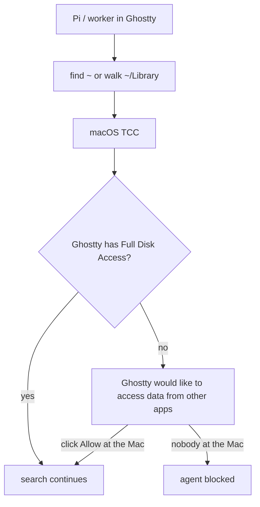

# macOS TCC vs unattended agents

When Ghostty lacks **Full Disk Access**, an agent `find ~` (or any walk that
hits other apps' data) pops a **modal** on the host terminal. The syscall
**blocks until a human clicks Allow**. If you are not at the Mac, the agent
hangs.

That dialog is TCC **App Data Isolation**. The responsible process is whichever
app owns the tty: usually Ghostty (`com.mitchellh.ghostty`).

Agents **may** search the machine when the user asks for something outside the
assigned worktree. Do not refuse home-wide `find` / `rg` / `fd` / `mdfind` as
policy. The durable fix is the FDA grant, not a search ban.

## One-time grant (you, at the Mac)

1. Open **System Settings → Privacy & Security → Full Disk Access**.
2. Enable **Ghostty**. If Ghostty is missing, add `/Applications/Ghostty.app`.
3. If a narrower walk still prompts, also grant Ghostty under **Files and
   Folders** (Desktop, Documents, Downloads) and any **App Data** / other-apps
   toggle your macOS version shows.
4. Quit and reopen Ghostty so the grant attaches to new processes.
5. Optional: grant **Herdr** or **Pi** if a prompt names those binaries
   instead of Ghostty.

Do **not** `tccutil reset` unless you intend to re-click every grant.

If a TCC dialog still appears after FDA, the grant did not attach to this
Ghostty process — relaunch Ghostty. Nothing in the intelligence map or Herdr
can click that dialog remotely.
